CUDA Path Tracer
================

**University of Pennsylvania, CIS 5650: GPU Programming and Architecture, Project 3**

* Anna Dai
* Tested on: Windows 11 Home, AMD Ryzen 9 5950X @ 3.40GHz 128GB, NVIDIA GeForce RTX 3090 Ti 24GB, personal machine

This is a physically-based path tracer that runs entirely on the GPU. Instead of giving each pixel a thread and looping the whole path inside one kernel, the renderer parallelizes over *path segments*.

> TODO: replace this hero image with the custom scene

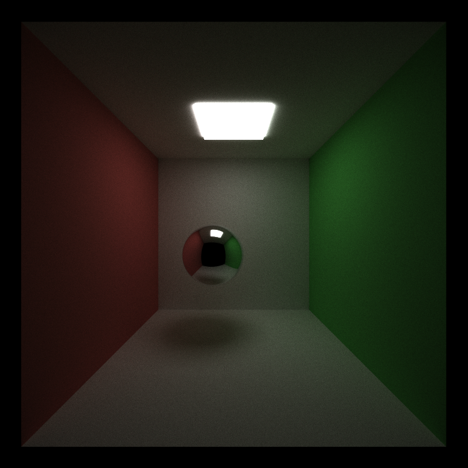

*Cornell box with a perfect mirror sphere. 800x800, 5000 samples per pixel, trace depth 8, compaction, material sorting and stochastic anti-aliasing all on. 36.0 ms/iteration, so the full render takes just over three minutes.*

## Overview

The renderer parallelizes over *path segments*: the depth loop lives on the host, and each kernel launch advances every live path by exactly one bounce.
Path state sits in device-memory arrays between launches, which is what makes it possible to compact dead paths away and reorder live ones by material before shading.

One iteration of the pipeline looks like this:

```
generateRayFromCamera            one ray per pixel, jittered inside the pixel for AA
for depth in 0 .. DEPTH-1:
    computeIntersections         closest hit for every live path
    sort by materialId           toggleable, groups same-material paths together
    shadeMaterial                evaluate BSDF, update throughput, spawn next ray
    stream compaction            thrust::partition, drop terminated paths
    break if no paths remain
finalGather                      accumulate each path into its pixel via pixelIndex
```

Because compaction and sorting both shuffle the path array, every `PathSegment` carries its own `pixelIndex` — that is the only thing that lets the final gather find its way home.

## Core pipeline

These are the pieces everything else is built on: the shading kernel, and the three stages that reshape the path array around it.

Timing is a host-side `std::chrono` measurement around the whole `pathtrace()` call, averaged per 100 iterations over a full 5000-iteration run with `PERF_LOG` on, at 800x800 and trace depth 8, which means 640,000 paths are born per iteration.

Every timing in this README changes one variable at a time. The scripts, scenes, iteration counts and raw readings behind each table are in [`analysis/perf-data.md`](analysis/perf-data.md).

The three optimizations below were each measured on the same open Cornell box, a scene with seven primitives and two BSDFs.

| Feature | Effect on this scene |
|---|---|
| Stream compaction | +3.3 ms/iteration, 19% slower |
| Material sorting | +15.9 ms/iteration, 79% slower |
| Anti-aliasing | -0.29 ms, within measurement noise |

Two of the three cost more than they save here. That looks like a property of the scene rather than of the implementations: compaction and sorting target idle warp lanes and branch divergence, and a scene this simple has little of either, while the bandwidth they spend moving path segments around is the same either way. The sections below take each one in turn.

### Shading

Shading is done with a single kernel that branches on material type. 
- Ideal diffuse surfaces: use cosine-weighted hemisphere sampling, where the cosine term in the estimator and the cosine in the PDF cancel, so throughput is just multiplied by the surface albedo
- Perfect specular surfaces: reflect the incoming direction about the normal with no randomness at all
- Dielectric surfaces (glass, water): reflect or refract, chosen per bounce with the Schlick approximation of Fresnel, with total internal reflection handled explicitly
- Geometry: the base code's spheres and boxes plus triangle meshes loaded from glTF 2.0 with a hand-written loader, each mesh behind a toggleable bounding-box test

- Rays that miss the scene entirely, or that run out of bounces before finding the light -> black
- Rays that land on an emitter settle up immediately -> the accumulated throughput is multiplied by the emitted radiance and the path terminates

**Diffuse, against a reference render**

| This renderer, 5000 spp | Reference, 5000 spp |
|---|---|
| 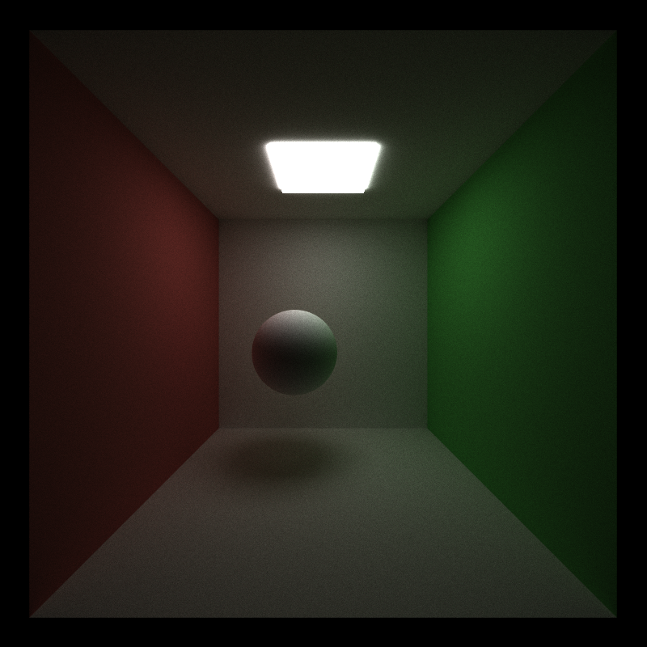 |  |

The render matches the reference on the two things that break first if the diffuse BSDF or the throughput bookkeeping is wrong: the color bleeding off the red and green walls, and the soft contact shadow under the sphere.

Per-pixel comparison: mean absolute difference 2.1 out of 255, identical global means, and every 4x4 region mean within 0.07%. That is the Monte Carlo noise left at 5000 samples, not a systematic difference.

**Specular**

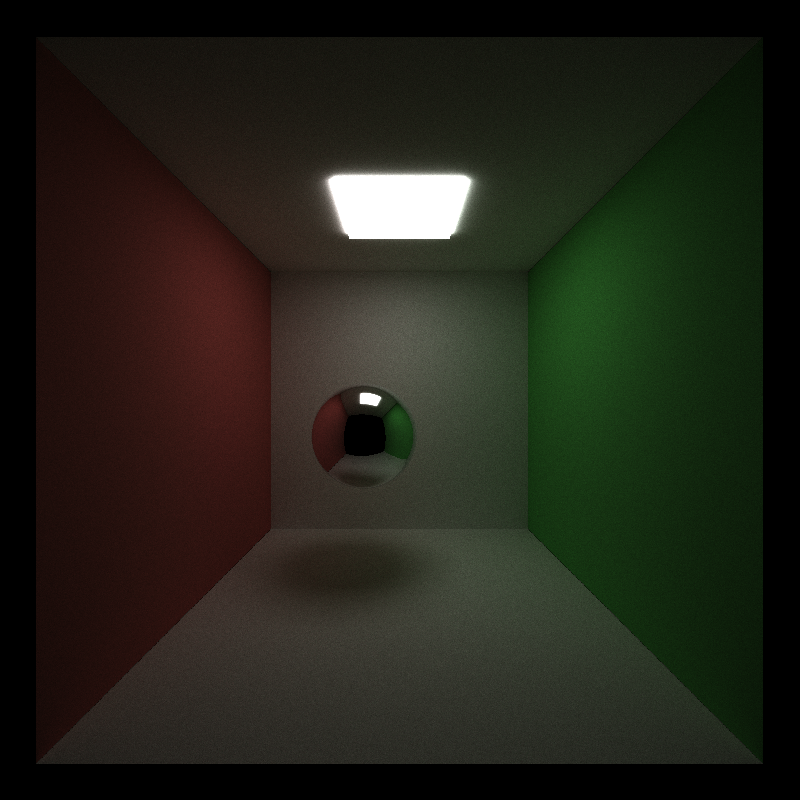

*Same scene, sphere switched to `Specular` with roughness 0. 800x800, 5000 spp, depth 8.*

- The mirror picks up the red and green walls and reflects the light straight back at the camera
- The dark disk in the middle is the camera's own line of sight leaving through the open front of the box -> nothing to hit -> black

### Stream compaction

#### Paths actually survive each bounce

Path counts are taken from iteration 1 of the open Cornell box:

| Bounce | Paths alive | Fraction of the original 640k |
|---|---|---|
| start | 640,000 | 100% |
| 1 | 523,164 | 82% |
| 2 | 362,150 | 57% |
| 3 | 279,680 | 44% |
| 4 | 222,899 | 35% |
| 5 | 180,366 | 28% |
| 6 | 146,600 | 23% |
| 7 | 119,912 | 19% |

- Between 18% and 31% of the surviving paths die at every bounce, either escaping the open front of the box or landing on the light. Bounce 2 is the outlier at 31%; the rest sit between 18% and 23%
- Without compaction all 640,000 threads launch at every depth anyway -> by the last bounce four out of five do nothing but read `remainingBounces`, see zero, and return

#### Compaction on versus off

| Configuration | avg ms/iteration | ~FPS |
|---|---|---|
| Compaction on (`thrust::partition`) | 20.40 | 49 |
| Compaction off | 17.09 | 59 |

Compaction is a net *loss* of 3.3 ms/iteration here, a 19% slowdown, which is the opposite of what the idle-thread argument predicts. That argument only counts the work saved, not the work added.

- Work saved is small: 7 primitives in the scene, so one bounce of intersection + shading is a handful of ray-box tests. A warp full of dead threads costs very little
- Work added is not: `thrust::partition` runs over the path array 8 times per iteration, physically moving 44-byte `PathSegment` structs through global memory
- The bandwidth spent shuffling outweighs the arithmetic it saves

The two configurations converge to the same image without being byte-identical. Over the 5000-sample pair the mean absolute difference is 1.5 out of 255 and the global means agree to three decimals, which is residual Monte Carlo noise rather than a disagreement.

They are not bit-exact because compaction moves a path into a different array slot, and the RNG is seeded per index, so the path draws a different random number than it would have uncompacted.

The balance should flip once per-ray work gets expensive, as it does with meshes, thousands of primitives and deeper traces: an idle warp slot then costs more while a partition costs the same. This comparison is one to re-measure once a BVH is in place.

#### Open versus closed scene

`scenes/cornell_closed.json` is the same room with a wall across the open front at z=+5 and the camera moved inside to sit just in front of it, so nothing can leave the scene.

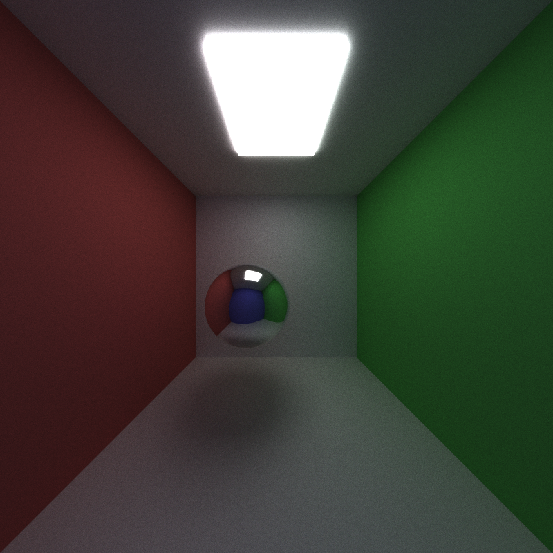

*The closed box at 5000 spp, 800x800, depth 8. The centre of the mirror sphere used to be a black disk where the camera's own line of sight escaped through the open front; it now reflects the blue wall standing behind the camera, which is the quickest visual confirmation that the room is really sealed.*

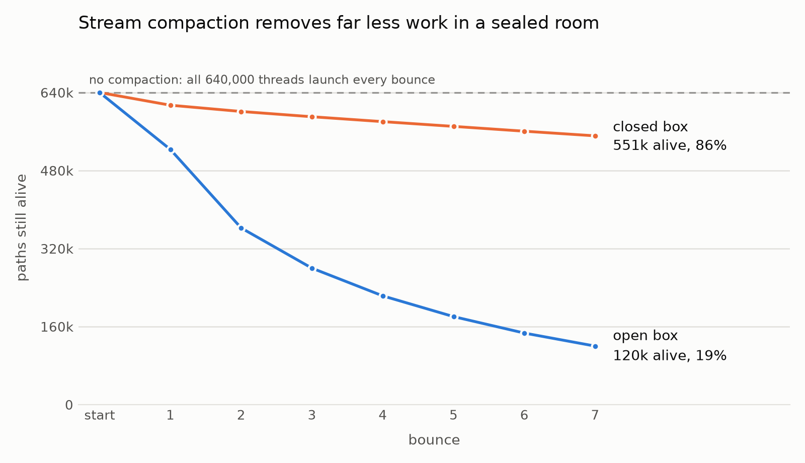

*Unterminated paths after each bounce of a single iteration, plotted from `analysis/data/paths.csv` by `analysis/scripts/plot-paths.py`. The dashed line is what runs when compaction is off, which is every thread at every depth in both scenes.*

| Bounce | Paths alive, open box | Paths alive, closed box |
|---|---|---|
| start | 640,000 (100%) | 640,000 (100%) |
| 1 | 523,164 (82%) | 613,916 (96%) |
| 2 | 362,150 (57%) | 601,084 (94%) |
| 3 | 279,680 (44%) | 590,284 (92%) |
| 4 | 222,899 (35%) | 580,254 (91%) |
| 5 | 180,366 (28%) | 570,499 (89%) |
| 6 | 146,600 (23%) | 560,637 (88%) |
| 7 | 119,912 (19%) | 551,106 (86%) |

| Configuration | Open box | Closed box |
|---|---|---|
| Compaction on | 20.40 ms, 49 FPS | 35.97 ms, 28 FPS |
| Compaction off | 17.09 ms, 59 FPS | 19.74 ms, 51 FPS |

Sealing the box removes the only cheap way for a path to die, and that turns compaction from a mild loss into a severe one.

- Compaction costs 3.3 ms/iteration in the open box and 16.2 ms in the closed one, a 19% slowdown against an 82% slowdown -> the same optimization is roughly five times more expensive once the room is sealed
- The path counts say why: `thrust::partition` pays for the length of the array it scans and moves. The open box collapses from 640k to 120k over eight bounces, so its later partitions are cheap. The closed box never falls below 551k, so every bounce moves nearly the whole array and deletes almost nothing
- With compaction off the two scenes are close, 17.09 against 19.74, because neither one shortens its launches and the sealed room only does a little more real intersection work -> most of the closed box's 35.97 ms is compaction's own overhead rather than the scene being intrinsically harder. One caveat on comparing the two scenes' absolute times: the closed box also moves the camera inside the room and widens the FOV from 45° to 60°, so its ray distribution differs; the on/off comparisons within each scene are unaffected
- The margin is wide enough to invert the ranking: the closed box with compaction off (19.74 ms) beats the open box with compaction on (20.40 ms)

### Material sorting

| Configuration | avg ms/iteration | ~FPS |
|---|---|---|
| Sort off | 20.11 | 50 |
| Sort on (`thrust::sort_by_key`) | 36.03 | 28 |

Both rows have compaction and anti-aliasing on, so sorting is the only variable. It costs 15.9 ms per iteration, a 79% slowdown.

- What it targets: warp divergence in the shading kernel, by making a warp's 32 threads hit the same material branch
- Why there is nothing to win here: `shadeMaterial` branches three ways (emitter, scatter, miss) and `scatterRay` splits again into diffuse and specular, none of them expensive -> almost no divergence to cure
- What it costs: a full `thrust::sort_by_key` over 20-byte intersection keys and 44-byte path values, up to 640k elements, at every one of the 8 bounces
- When it would pay: many materials with genuinely different shading costs, so an unsorted warp stalls on its slowest thread — refraction with Fresnel, texture lookups, a microfacet BSDF

One detail is worth flagging. The paths-alive counts shift slightly when sorting is on, for instance 362,755 against 362,150 at bounce 2. This is most likely because sorting moves a path into a different array slot while the RNG is seeded per index, so the path draws a different random number than it would have unsorted. The two runs are statistically equivalent and converge to the same image.

### Anti-aliasing

Each camera ray is jittered by a uniform random offset inside its pixel footprint, so over 5000 iterations every pixel integrates its whole area instead of one fixed point. 

Cost: seeding one RNG per ray in the generation kernel and drawing from it twice, once for the x offset and once for the y.

Note that pictures below are 4x nearest-neighbor blowups, so the pixel grid stays visible:

| | AA off | AA on |
|---|---|---|
| Sphere silhouette | 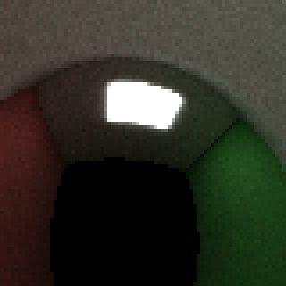 | 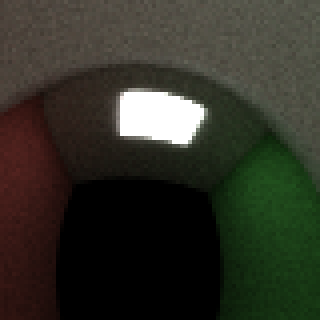 |
| Light fixture edge | 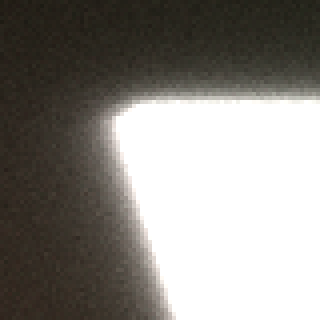 | 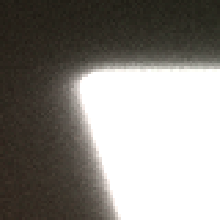 |

The sphere pair clearly shows that without jitter the silhouette is a hard staircase of fully-lit and fully-dark pixels; with jitter the boundary pixels land in between, in proportion to how much of the sphere actually covers them.

| Configuration | avg ms/iteration | range over 50 blocks | ~FPS |
|---|---|---|---|
| Compaction on, sorting off, AA off | 20.40 | 19.65 – 21.19 | 49 |
| Compaction on, sorting off, AA on | 20.11 | 19.50 – 21.31 | 50 |

The difference is -0.29 ms, meaning the run with jitter came out marginally *faster*, and the two ranges overlap almost entirely. The cost of anti-aliasing is smaller than the run-to-run spread of either run, so this measurement cannot separate it from zero. What it does establish is a bound: whatever AA costs, it is well under 1.5% of a frame.

That is where the work sits, too. The jitter is two random draws in the ray generation kernel, which runs once per iteration, while frame time is dominated by the eight-deep bounce loop that anti-aliasing never touches. It buys a visibly better silhouette for nothing measurable.

An earlier run had put the cost at 3 to 9 ms. That measurement was contaminated: re-running the same three toggles gave 36.03 ms against the 40.5 – 45.9 ms first recorded, so the earlier figure is discarded rather than reported.

### The core pipeline on a GPU versus a CPU

A single-threaded CPU tracer would take minutes per frame instead of milliseconds, and two of the three optimizations above would be pointless on it.

- Stream compaction: exists because GPU threads run in lockstep warps and an idle lane is wasted silicon. A CPU loop skips a dead path with a branch that costs nothing
- Material sorting: exists because a diverging warp serializes its branches. A CPU core takes the branch it needs and moves on
- Anti-aliasing: transfers unchanged, same cost on either side

## Features

### Mesh loading

Meshes come in as glTF 2.0 through a loader written from scratch on the `json.hpp` and `stb_image.h` the base code already ships.

How a `.gltf` is read:
- The JSON is an index over a raw `.bin` blob: attribute -> accessor -> bufferView -> byte range
- POSITION, NORMAL, TEXCOORD_0 and the index buffer are each `start byte + i * stride`, reinterpreted as float, uint16 or uint32
- Every triangle is transformed into world space at load time with the scene's `TRANS` / `ROTAT` / `SCALE`, normals through the inverse transpose
- All triangles live in one flat device array; a mesh geom is a `[triStart, triCount)` range into it

World-space triangles mean the intersection kernel never inverse-transforms a ray, and the bounding box below (later a BVH) is built directly in world space.

Intersection is Moller-Trumbore with one change: the glm version culls back faces, which is fatal for refraction, where a ray has to hit the inside of the mesh it is leaving. The renderer uses its own copy that only rejects the parallel case. Normals are interpolated from the three vertex normals, so smooth-shaded exports render smooth.

| Native cube vs glTF cube | Suzanne, 15 744 triangles |
|---|---|
| 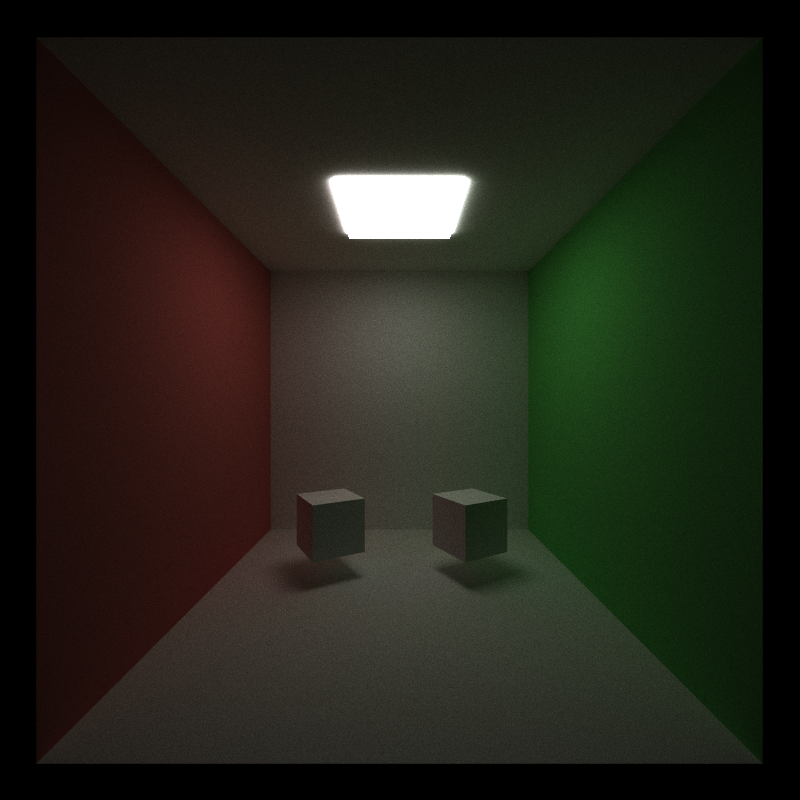 | 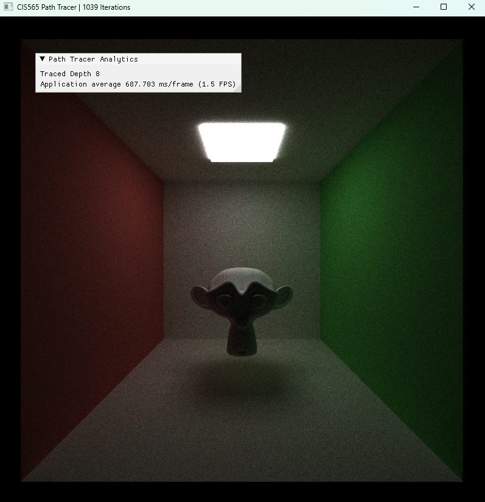 |

*Left: the base code's cube beside the same cube from a Blender glTF export, same material, rotation and scale, 5000 spp. Right: Suzanne with two subdivision levels, 1000 spp, depth 8, about 690 ms per iteration with bounding-box culling on.*

Correctness check: a slightly larger red mesh cube placed exactly on top of the native one rendered as a solid red cube with no white poking through, which pins down the transform, the winding and the intersection at once.

#### Bounding-box culling

Each mesh keeps the world-space AABB of its triangles. With `MESH_AABB_CULL` on, a ray does a slab test first and skips the whole triangle loop on a miss. Suzanne at two triangle counts:

| Model | Triangles | Culling off | Culling on | Speedup |
|---|---|---|---|---|
| suzanne_4k | 3 936 | 226.6 ms | 177.5 ms | 1.28x |
| suzanne_16k | 15 744 | 843.1 ms | 622.7 ms | 1.35x |

- Time grows close to linearly with triangle count: four times the triangles cost 3.5x with culling and 3.7x without, because without an acceleration structure every ray that reaches the box still tests every triangle
- The box saves only about a quarter because Suzanne fills the middle of the frame, so nearly every primary ray hits it anyway; the savings come from secondary rays leaving the walls in other directions
- 1.2 fps at 16k triangles is the number a BVH has to beat

#### Mesh loading on a GPU versus a CPU

A CPU path tracer would load the glTF the same way; the difference is in traversal.
- The GPU wins on raw throughput: every live path tests the mesh at once, so 1.2 fps at 16k triangles is still up to 640k paths each testing 15,744 triangles per bounce
- The GPU loses on divergence: threads in a warp run in lockstep, so a thread whose ray missed the bounding box still waits while its neighbours walk the whole triangle loop. The box test saves that thread's arithmetic but not its time. A CPU core skips the loop the moment its own ray misses

#### Where mesh loading goes next
- A BVH or octree turns the linear scan into a logarithmic one, which is the only change that moves the 843 ms figure by more than a constant factor
- Sorting triangles into a spatially coherent order, or storing them as a structure of arrays, so that consecutive threads read consecutive memory
- Loading every primitive of a mesh and the glTF's own node transforms, both of which the loader currently ignores

### Refraction

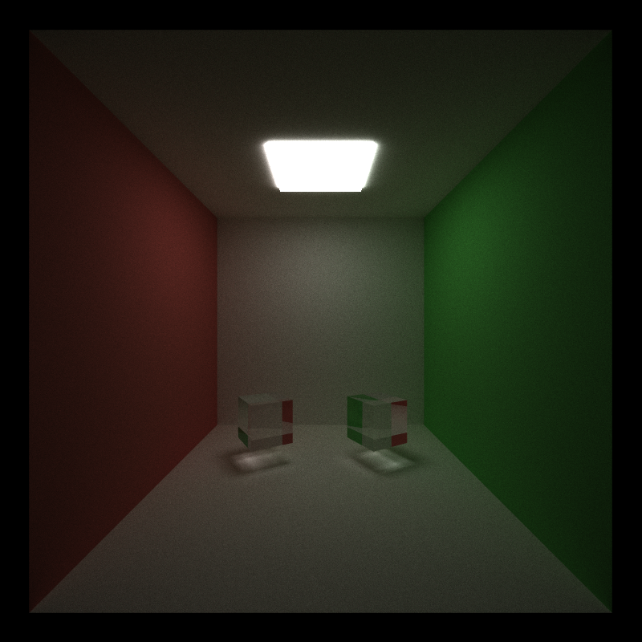

*Two glass cubes, IOR 1.5: the native box on the left, the same cube loaded from glTF on the right. 800x800, 5000 spp, depth 32. The red and green on their side faces are the walls seen by total internal reflection.*

Dielectrics are the third material type. Per hit:
- Entering or leaving is decided from the sign of `dot(direction, normal)`; the normal is flipped to face the ray
- The index ratio follows: air to glass on the way in, glass to air on the way out
- Schlick gives the reflectance R for that angle; the path reflects with probability R and refracts with probability 1 - R, which keeps the estimator unbiased with no division by the pick probability
- Total internal reflection is detected from the Snell discriminant directly rather than from `glm::refract`, for a reason in the bloopers

| | Mirror | Glass, IOR 1.5 |
|---|---|---|
| Open box |  | 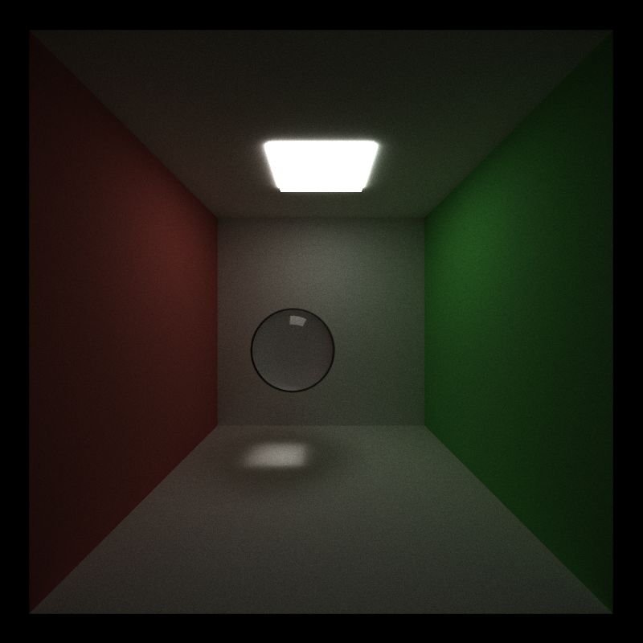 |
| Closed box |  | 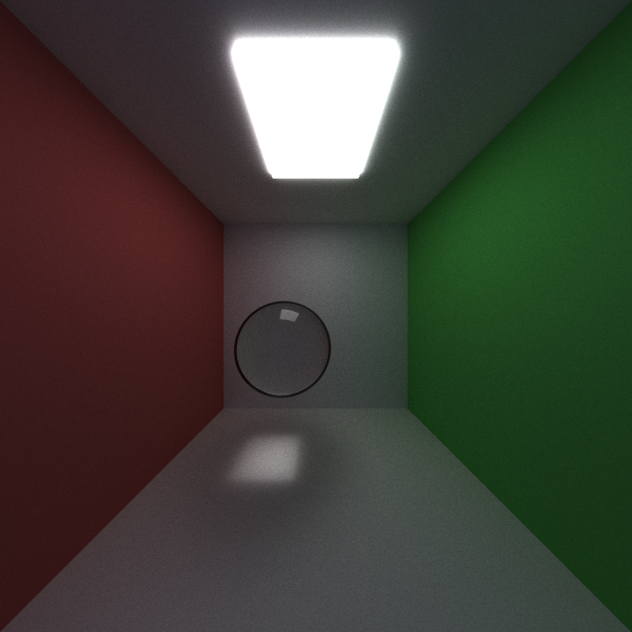 |

*Each row is one scene file with only the sphere's material changed. 800x800, 5000 spp, depth 8. The closed box adds a blue wall behind the camera and moves the camera inside the room.*

What the glass sphere has to get right:
- The room appears upside down and mirrored inside it: the red wall shows up on the right
- The light is focused into a bright caustic on the floor, with the sphere's shadow around it
- A faint highlight on top is the 4% Fresnel reflection at normal incidence

The dark rim is not a bug. In the open box, rays that reflect off the rim at grazing angles or refract through it at large deflections look out the open front and see nothing. In the closed box the rim thins to what a real glass sphere shows in a dim room: the compressed image of its own shadow and the unlit ceiling.

A glass *mesh* needed two more fixes, both in the bloopers: the box intersection's inside-hit normals disagreed with spheres and meshes, and this repo's glm returns NaN on total internal reflection.

#### Refraction performance

The same sphere as a mirror and as glass, in both boxes:

| Box | Mirror | Glass | Difference |
|---|---|---|---|
| Open | 37.0 ms | 37.4 ms | +1.1% |
| Closed | 64.8 ms | 65.5 ms | +1.0% |

The material is free at this scale. A dielectric hit costs one Schlick evaluation, one discriminant and one random draw more than a mirror hit, and the sphere covers under a tenth of the frame. The closed box is slower in both columns because paths there cannot escape and mostly run to the depth limit, which is the stream compaction story above, not the material's.

Nothing was done to accelerate it: there is nothing to amortize when the extra work is a handful of multiplies per hit.

The cost that does show up with glass is indirect: it wants a deeper trace. The glass scenes at depth 8 and 32:

| Box | Depth 8 | Depth 32 | Ratio |
|---|---|---|---|
| Open | 37.1 ms | 55.7 ms | 1.5x |
| Closed | 65.0 ms | 219.1 ms | 3.4x |

- Open box: four times the depth costs half again as much, because most paths leave through the open front within a few bounces and compaction removes them from every later launch
- Closed box: nothing escapes, so paths only end by hitting the light, and nearly every extra bounce is paid for in full

#### Refraction on a GPU versus a CPU

- The per-hit arithmetic is identical on both, so the material itself neither benefits nor suffers
- Where the GPU suffers is branching: reflect-or-refract is a random choice per path, so a warp that shades glass takes both branches. That only matters when many paths in a warp are glass, which material sorting is meant to arrange, and the 1% above says it is not yet worth worrying about
- Extra depth is where the GPU benefits, but only when paths die: compaction shrinks each launch, so depth 32 costs 1.5x depth 8 in the open box. In the closed box it costs 3.4x, close to the 4x a CPU would pay, because there is nothing to compact

#### Where refraction goes next

- Use the full Fresnel equations instead of Schlick; the approximation is worst exactly where glass is most visible, near grazing angles
- Russian roulette instead of a hard depth cut, so trapped paths die by probability rather than all at once at depth 32
- Nested dielectrics with an explicit medium stack, so water inside a glass uses the glass-to-water ratio at the shared boundary instead of pretending there is air between them
- Rough glass through a microfacet distribution, which is what a real kitchen glass looks like

## Bloopers

### The glass cube that only half existed

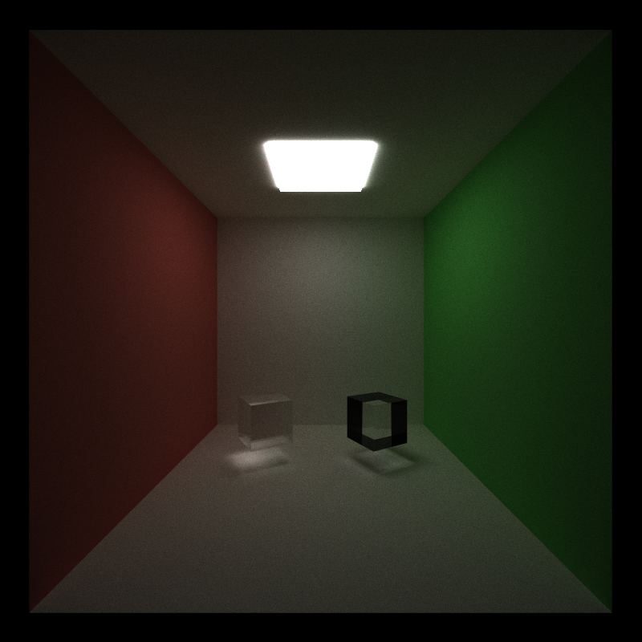

*Left: a native glass cube. Right: the same cube loaded from glTF, same material, same IOR. 5000 spp, depth 32.*

Both cubes go through the same `scatterRay`, so the difference had to be on the intersection side. Narrowing it down:
- Bounding-box culling off: frame still there
- Mesh unrotated: still there
- Fully closed box: still there, so paths were being lost, not escaping
- IOR 1.0: both cubes vanish, so entry and exit hits are found correctly
- Mirror material: both cubes identical, so single hits and normals are fine
- A debug view that colours paths by how they ended: the frame lit up as "direction is NaN"

Only paths that reflected *inside* the mesh died, and they died with a NaN direction. The source is this repo's glm 0.9.x, whose `refract` handles total internal reflection as

```cpp
return (eta * I - (eta * dotValue + sqrt(k)) * N) * static_cast<T>(k >= 0);
```

`sqrt` of a negative `k` is NaN, and NaN times zero is still NaN, so the zero vector the code was checking for never arrives.

Why nothing had triggered it before:
- Light inside a solid sphere always meets the far wall below the critical angle, so a glass sphere never hits TIR
- The native cube had a second bug hiding it: the base code's box intersection returns a normal facing the ray on inside hits, while sphere and mesh return the outward normal
- The dielectric code reads "entering or leaving" from that sign, so the native cube always thought it was entering, used the wrong index ratio on the way out and never reflected internally. It looked clean because it never took the path that crashed

Both fixes are one-liners: compute `k` in `scatterRay` and only call `refract` when it is non-negative, and negate the box normal on inside hits so all three geometry types agree.

After both fixes the two cubes agree, and the side faces mirror the red and green walls, which is total internal reflection doing what it should. That render is the image at the top of the [Refraction](#refraction) section.

### The Blender cube that was twice the size

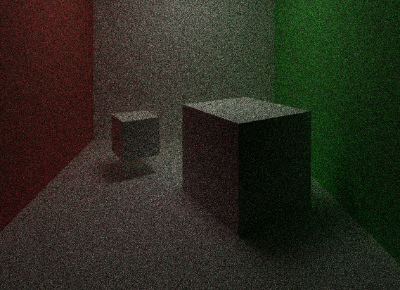

*First render with a loaded glTF mesh. Left: native cube. Right: the same JSON transform on a mesh cube.*

Not a code bug. Blender's default cube spans -1 to 1 and this renderer's native cube spans -0.5 to 0.5, so the same `SCALE` gives a mesh twice as big. The loader, the transform and the intersection were right on the first run.

## Build notes

`CMakeLists.txt` has one change beyond the source file list: MSVC gets `/Zc:preprocessor` for both C++ and CUDA, which enables the conforming preprocessor.

```powershell
cmake --build build --config Release
& ".\build\bin\Release\cis565_path_tracer.exe" "scenes/cornell.json"
```

- Esc saves the image and exits
- S saves the image without exiting, and the filename is printed to the console

Every optional stage is a `#define` at the top of [`src/pathtrace.cu`](src/pathtrace.cu), so any combination can be built and measured without touching the rest of the code:
- `STREAM_COMPACTION`, `SORT_BY_MATERIAL`, `ANTIALIASING`, `MESH_AABB_CULL`, `PERF_LOG`
- `DEBUG_NORMALS`: paints the first hit with its normal
- `DEBUG_TERMINATION`: paints each path by how it ended (depth exhausted, NaN direction, NaN origin, genuine miss). This is how the glass bug in the bloopers was found

## References
- Path tracing background and the BSDF formulation follow [Physically Based Rendering, 4th edition](https://pbr-book.org/4ed/Reflection_Models/Diffuse_Reflection)
- Staged-kernel pipeline follows the CIS 5650 [path tracing primer recitation](https://docs.google.com/presentation/d/1rr6zFbpVkdMEkxBK4QLN4_tBRo168SJA_bMi2GkBB6I/edit?usp=drive_link)
- Compaction and sorting use [Thrust](https://nvidia.github.io/cccl/thrust/)
