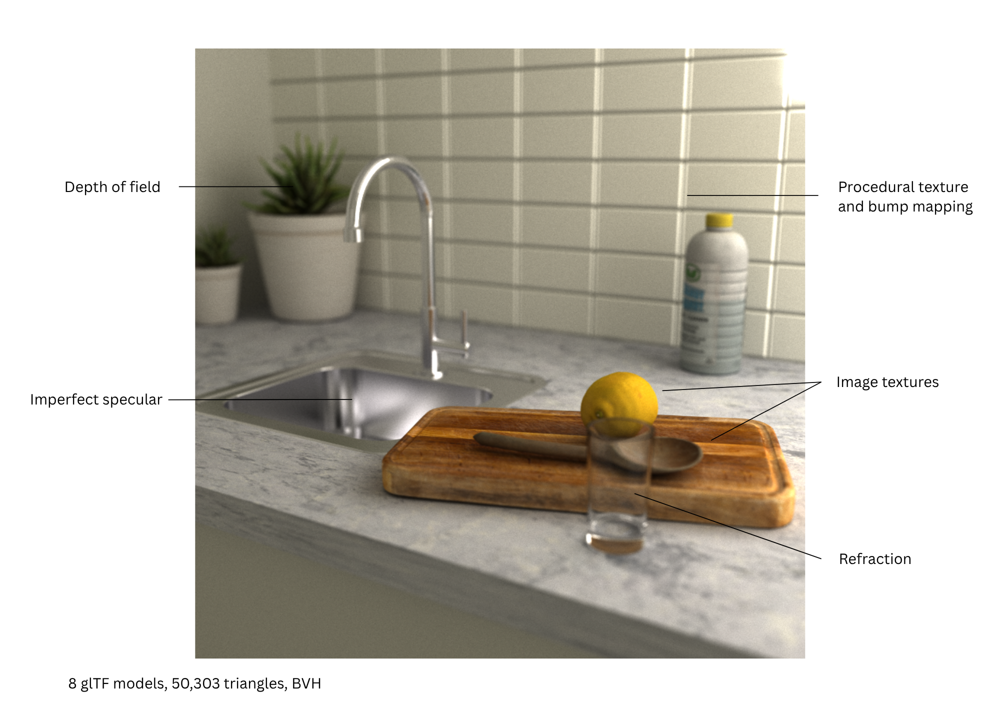
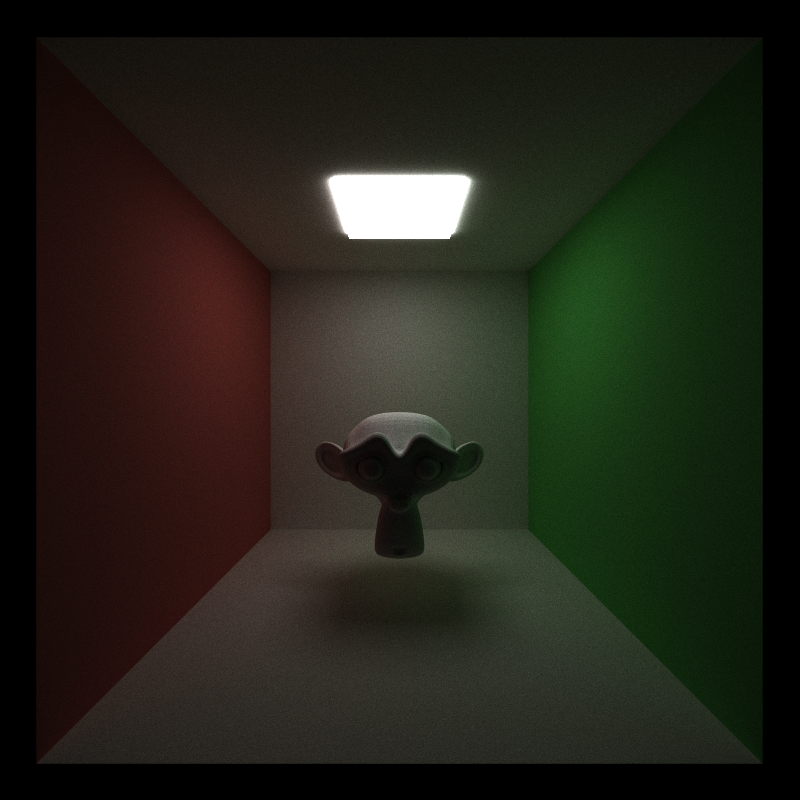
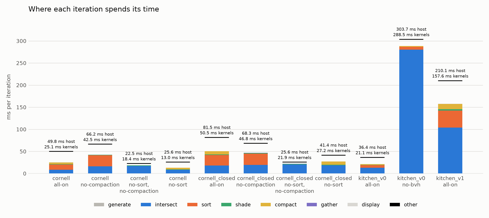
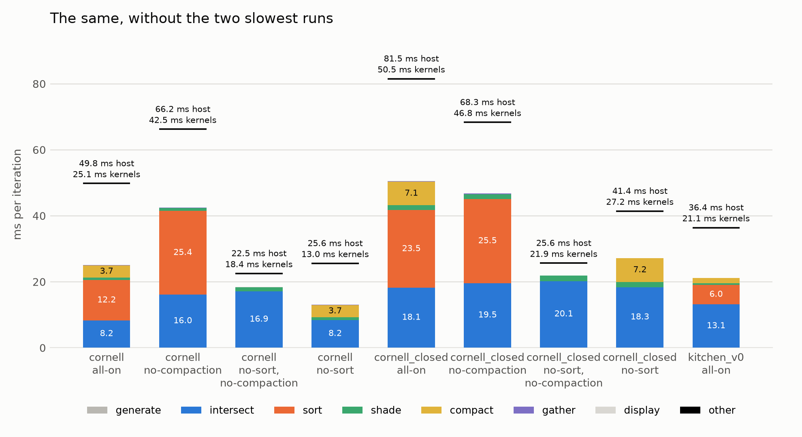

CUDA Path Tracer
================

**University of Pennsylvania, CIS 5650: GPU Programming and Architecture, Project 3**

* Anna Dai
* Tested on: Windows 11 Home, AMD Ryzen 9 5950X @ 3.40GHz 128GB, NVIDIA GeForce RTX 3090 Ti 24GB, personal machine

A physically-based path tracer that runs entirely on the GPU.

<p align="center"></p>

<p align="center"><em>A kitchen sink in afternoon light. 800x800, 4000 samples per pixel, trace depth 16, about 205 ms per iteration.</em></p>


## Overview

The renderer parallelizes over path segments, not over pixels. Each kernel launch advances every live path by exactly one bounce, and the depth loop lives on the host. Path state sits in device-memory arrays between launches, which makes it possible to compact dead paths away and to reorder live ones by material before shading.

<p align="center"></p>
<p align="center"><em>The same render with the features marked. The sink uses a Phong exponent of 200 and the glass an IOR of 1.5.</em></p>

### Highlights

- Pipeline
  - Staged kernels with stream compaction, material sorting and stochastic anti-aliasing
  - On a Cornell box, compaction pays only when the box is open and sorting is on (-24%)
  - In the other cases it costs 2 to 15 ms, from host-side thrust allocation and synchronization rather than from the kernels
- Geometry
  - glTF 2.0 loader written from scratch
  - BVH over each mesh: 21x on a 15 744-triangle mesh, 9x on the kitchen
- Surfaces
  - Diffuse, perfect mirror, Phong-lobe glossy
  - Glass with Fresnel and total internal reflection
  - Image and procedural textures, bump mapping
- Lighting and camera
  - Direct lighting: the last ray is aimed at the light, about 10x less floor noise at depth 2
  - Thin-lens depth of field
- Profiling
  - Per-stage breakdown with Nsight Systems
  - Shading is at most 7.5% of the kernel time in every run
  - The GPU sits idle about half of a Cornell frame

### One iteration

```
generateRayFromCamera            one ray per pixel, jittered inside the pixel for AA
for depth in 0 .. DEPTH-1:
    computeIntersections         closest hit for every live path
    sort by materialId           toggleable, groups same-material paths together
    shadeMaterial                evaluate BSDF, update throughput, spawn next ray
    stream compaction            thrust::partition, drop terminated paths
    break if no paths remain
finalGather                      accumulate each path into its pixel via pixelIndex
```

Compaction and sorting both shuffle the path array, so every `PathSegment` carries its own `pixelIndex`. That is the only thing that lets the final gather find its way home.

### Section Breakdown

- [Build notes](#build-notes): how to build, toggles, debug views
- [Core pipeline](#core-pipeline): shading, compaction, sorting, anti-aliasing
- [Features](#features): everything built on top of the pipeline
- [Performance analysis](#performance-analysis): where the time goes, from Nsight Systems
- [Bloopers](#bloopers): bugs worth remembering

## Build notes

Built with Visual Studio 2022 and CUDA 13.3 on Windows 11, for an RTX 3090 Ti. The CUDA architecture is left at `native`, so CMake picks the GPU it finds. `CMakeLists.txt` has one change beyond the source file list: MSVC gets `/Zc:preprocessor` for both C++ and CUDA, which enables the conforming preprocessor.

```powershell
cmake -S . -B build -G "Visual Studio 17 2022"
cmake --build build --config Release
& ".\build\bin\Release\cis565_path_tracer.exe" "scenes/core/cornell.json"
```

Every timing in this README is from a Release build. Debug and RelWithDebInfo compile the CUDA with `-G`, which turns off device optimization and makes a frame many times slower, so they are for stepping through kernels, not for measuring them.

Keys

- Esc saves the image and exits
- S saves the image without exiting, and the filename is printed to the console

Toggles

Every optional stage is a `#define` at the top of [`src/pathtrace.cu`](src/pathtrace.cu), so any combination can be built and measured without touching the rest of the code.

- `STREAM_COMPACTION`, `SORT_BY_MATERIAL`, `ANTIALIASING`, `MESH_AABB_CULL`, `BVH`, `DIRECT_LIGHTING`, `DEPTH_OF_FIELD`: all on by default except `DIRECT_LIGHTING`
- `PERF_LOG` in [`src/perf.h`](src/perf.h): prints paths alive per bounce, ms per iteration, and how those ms split across the pipeline stages
- `DEBUG_NORMALS`, `DEBUG_UV`, `DEBUG_TANGENT`, `DEBUG_BUMP`: paint the first hit with its normal, UV, tangent or bumped normal
- `DEBUG_TERMINATION`: paints each path by how it ended (depth exhausted, NaN direction, NaN origin, genuine miss). This is how the glass bug in the bloopers was found

## Core pipeline

These are the pieces everything else is built on: the shading kernel, and the three stages that reshape the path array around it.

### How the timings were taken

Every timing is ms per iteration at 800x800 unless a caption says otherwise, which is 640,000 paths per iteration. How each number was measured, with the raw readings, is in [`analysis/perf-data.md`](analysis/perf-data.md).

The three optimizations were measured on the Cornell box, a scene with seven primitives and two BSDFs, open and with the front sealed. Compaction and sorting interact, so one run measured all four combinations of the two in both boxes. The compaction and sorting sections below both read from this table.

| Scene | Sorting | Compaction on | Compaction off | Compaction effect |
|---|---|---|---|---|
| Open box | on | 47.2 | 62.1 | -15.0 (-24%) |
| Open box | off | 22.0 | 19.8 | +2.2 (+11%) |
| Closed box | on | 80.8 | 65.9 | +14.9 (+23%) |
| Closed box | off | 38.4 | 23.4 | +15.0 (+64%) |

*ms per iteration, 800x800, depth 8, anti-aliasing on, no profiler.*

*Each cell is the mean of nine blocks of 100 iterations, the first block dropped as warm-up. The blocks of a cell spread by under 1.6 ms, except the two cells with both on, which spread by 4 and 5 ms.*

> Compaction pays only in the open box with sorting on, where it also shrinks what the sort has to process.
> In the other three rows it costs 2 to 15 ms.
> Sorting always costs, 25 to 42 ms depending on the row.

- Sorting targets branch divergence. A scene with two materials has almost none, so there is nothing for it to win
- Compaction does remove idle threads, four out of five by the last bounce in the open box. But its cost does not depend on the scene: allocation and synchronization on the host around every thrust call
- The closed box has almost no idle threads to remove, so it only pays that cost
- Anti-aliasing is separate and costs nothing this measurement can see

Each one is taken in turn below, and [Performance analysis](#performance-analysis) shows the split between GPU and host.

### Shading

Shading is one kernel that branches on material type.

- **Diffuse**: cosine-weighted hemisphere sampling. The cosine in the estimator and the cosine in the PDF cancel, so throughput is just multiplied by the surface albedo
- **Perfect specular**: reflect the incoming direction about the normal, with no randomness at all
- **Dielectric** (glass, at any index of refraction): reflect or refract, chosen per bounce with the Schlick approximation of Fresnel, with total internal reflection handled explicitly
- **Geometry**: the base code's spheres and boxes, plus triangle meshes loaded from glTF 2.0 with a hand-written loader, each mesh behind a toggleable bounding-box test or BVH

A ray that misses the scene, or runs out of bounces before finding the light, comes back black. A ray that lands on an emitter settles up immediately: the accumulated throughput is multiplied by the emitted radiance and the path terminates.

#### Diffuse, against a reference render

| This renderer, 5000 spp | Reference, 5000 spp |
|---|---|
|  |  |

The render matches the reference on the two things that break first if the diffuse BSDF or the throughput bookkeeping is wrong: the color bleeding off the red and green walls, and the soft contact shadow under the sphere.

Per pixel, the mean absolute difference is 2.1 out of 255, the global means are equal to three decimals, and every 4x4 region mean is within 0.07%. That is the Monte Carlo noise left at 5000 samples, not a systematic difference.

#### Specular

<p align="center"></p>

<p align="center"><em>Same scene, sphere switched to <code>Specular</code> with roughness 0. 800x800, 5000 spp, depth 8.</em></p>

The mirror picks up the red and green walls and reflects the light straight back at the camera. The dark disk in the middle is the camera's own line of sight leaving through the open front of the box -> nothing to hit -> black.

### Stream compaction

#### How many paths survive each bounce

Path counts after each bounce of iteration 1, with sorting, compaction and anti-aliasing on. The closed box is `scenes/core/cornell_closed.json`: the same room with a wall across the open front at z=+5 and the camera moved inside, just in front of it, so nothing can leave the scene.

<p align="center"></p>

<p align="center"><em>The closed box at 5000 spp, 800x800, depth 8. The center of the mirror sphere used to be a black disk, where the camera's own line of sight escaped through the open front. It now reflects the blue wall behind the camera, the quickest visual confirmation that the room is sealed.</em></p>

<p align="center"></p>

<p align="center"><em>Unterminated paths after each bounce of a single iteration. The dashed line is what runs when compaction is off: every thread at every depth, in both scenes.</em></p>

| Bounce | Paths alive, open box | Paths alive, closed box |
|---|---|---|
| start | 640,000 (100%) | 640,000 (100%) |
| 1 | 522,877 (82%) | 613,895 (96%) |
| 2 | 362,280 (57%) | 600,904 (94%) |
| 3 | 280,193 (44%) | 590,148 (92%) |
| 4 | 223,201 (35%) | 579,851 (91%) |
| 5 | 180,479 (28%) | 569,868 (89%) |
| 6 | 146,774 (23%) | 560,132 (88%) |
| 7 | 119,716 (19%) | 550,769 (86%) |

- Open box: between 18% and 31% of the surviving paths die at every bounce, escaping the open front or landing on the light. Bounce 2 is the outlier at 31%, the rest sit between 18% and 23%
- Closed box: nothing can escape, so only landing on the light ends a path. 4% die at the first bounce and under 2.2% at every later one
- Without compaction all 640,000 threads launch at every depth anyway, so in the open box four out of five do nothing by the last bounce: they read `remainingBounces`, see zero, and return

#### Compaction on versus off

The effect is the last column of the table at the top of [Core pipeline](#core-pipeline). The four rows differ, for different reasons. The split between kernel time and host time under Nsight Systems is in [Performance analysis](#sorting-and-compaction-together).

- Open box, sorting off: **a loss of 2.2 ms (+11%)**
  - That is the opposite of what the idle-thread argument predicts. The argument counts only the work saved on the GPU, not the work added around it
  - `thrust::partition` runs 8 times per iteration, and each call allocates scratch memory, frees it, and copies its result count back before the next launch can be issued
  - **At this scene size the host, not the GPU, sets the frame time**, so the host cost is what shows
- Open box, sorting on: **a gain of 15.0 ms (-24%)**
  - The partition also shrinks the array that the sort processes at every bounce, and the sort is the most expensive stage by far, see [Material sorting](#material-sorting)
- Closed box: **a loss of 15 ms, 23% with sorting on and 64% with it off**
  - The array never shrinks, so **the saving that carries the open box is missing** while the cost is not
  - `thrust::partition` pays for the length of the array it scans and moves. The open box collapses from 640k to 120k paths over eight bounces, so its later partitions are cheap
  - The closed box never falls below 551k, so every bounce moves nearly the whole array and deletes almost nothing
  - With compaction off the two boxes are close, 19.8 ms against 23.4 with sorting off. Neither one shortens its launches and the sealed room only does a little more real intersection work, so most of the closed box's 38.4 ms is compaction's own overhead, not a harder scene
  - One caveat on comparing the two scenes' absolute times: the closed box moves the camera inside the room and widens the FOV from 45 to 60 degrees, so its ray distribution differs. The on/off comparisons within each scene are unaffected

Compaction on and off converge to the same image without being byte-identical. Over a 5000-sample pair the mean absolute difference is 1.5 out of 255 and the global means agree to three decimals, which is residual Monte Carlo noise, not a disagreement.

They are not bit-exact because compaction moves a path into a different array slot. The RNG is seeded per index, so the path draws a different random number than it would have uncompacted.

### Material sorting

The cost of sorting per iteration, as the difference between rows of the table at the top of [Core pipeline](#core-pipeline):

| | Compaction on | Compaction off |
|---|---|---|
| Open box | 25.2 ms (+115%) | 42.3 ms (+214%) |
| Closed box | 42.4 ms (+110%) | 42.5 ms (+181%) |

Sorting targets warp divergence in the shading kernel, by making a warp's 32 threads hit the same material branch. There is little to win here:

- `shadeMaterial` branches three ways (emitter, scatter, miss) and `scatterRay` splits again into diffuse and specular, none of them expensive, so there is almost no divergence to cure
- The profiler agrees: in the open box shading takes 0.75 ms of the kernel time and sorting takes 12.2, so sorting would have to make shading free and then some to break even

What it costs is a full `thrust::sort_by_key` over 40-byte intersection keys and 44-byte path values, up to 640k elements, at every one of the 8 bounces. With a custom comparator thrust runs a merge sort, which the profiler shows as some twenty small kernels per bounce, 84 merge passes per iteration in the open box.

It would pay with many materials of genuinely different shading cost, so that an unsorted warp stalls on its slowest thread: refraction with Fresnel, texture lookups, a microfacet BSDF.

The paths-alive counts shift slightly when sorting is on, for instance 362,280 against 361,753 at bounce 2, with anti-aliasing on in both.

Most likely sorting moves a path into a different array slot while the RNG is seeded per index, so the path draws a different random number than it would have unsorted. The two runs are statistically equivalent and converge to the same image.

### Anti-aliasing

Each camera ray is jittered by a uniform random offset inside its pixel footprint, so over 5000 iterations every pixel integrates its whole area instead of one fixed point. The cost is one RNG seeded per ray in the generation kernel and two draws from it, one for x and one for y.

The pictures below are 4x nearest-neighbor blowups, so the pixel grid stays visible.

| | AA off | AA on |
|---|---|---|
| Sphere silhouette |  |  |
| Light fixture edge |  |  |

Without jitter the sphere's silhouette is a hard staircase of fully-lit and fully-dark pixels. With jitter the boundary pixels land in between, in proportion to how much of the sphere covers them.

| Configuration | avg ms/iteration | range over 9 blocks | ~FPS |
|---|---|---|---|
| Compaction on, sorting off, AA off | 21.86 | 21.18 to 22.58 | 46 |
| Compaction on, sorting off, AA on | 21.96 | 21.13 to 22.72 | 46 |

The difference is +0.10 ms, 0.5%, with the jitter run marginally slower, and the two ranges overlap almost entirely. The cost is smaller than the spread of either row, so this measurement cannot separate it from zero. It does establish a bound: the ranges are about 7% wide, so whatever AA costs is under a few percent of a frame.

That is where the work sits, too. The jitter is two random draws in the ray generation kernel, which runs once per iteration, while frame time is dominated by the eight-deep bounce loop that AA never touches.

> Anti-aliasing buys a visibly better silhouette for a cost this measurement cannot see.

### The core pipeline on a GPU versus a CPU

A single-threaded CPU tracer would take far longer per frame, and two of the three optimizations above would be pointless on it.

- Stream compaction exists because GPU threads run in lockstep warps and an idle lane is wasted silicon. A CPU loop skips a dead path with a branch that costs next to nothing
- Material sorting exists because a diverging warp serializes its branches. A CPU core takes the branch it needs and moves on
- Anti-aliasing transfers unchanged, with the same cost on either side

## Features

### Mesh loading

Meshes come in as glTF 2.0 through a loader written from scratch on the `json.hpp` and `stb_image.h` the base code already ships.

How a `.gltf` is read:

- The JSON is an index over a raw `.bin` blob: attribute -> accessor -> bufferView -> byte range
- POSITION, NORMAL, TEXCOORD_0 and the index buffer are each `start byte + i * stride`, reinterpreted as float, uint16 or uint32
- Every triangle is transformed into world space at load time with the scene's `TRANS` / `ROTAT` / `SCALE`, and normals through the inverse transpose
- Every primitive of every mesh in the file goes into the same geom, so a model exported in parts (pot, soil, plant) loads as one object. Node transforms are not applied, so the parts must be exported in place
- All triangles live in one flat device array, and a mesh geom is a `[triStart, triCount)` range into it

World-space triangles mean the intersection kernel never inverse-transforms a ray, and the bounding box below, and later the BVH, are built directly in world space.

Intersection is Moller-Trumbore with one change. The glm version culls back faces, which is fatal for refraction, where a ray has to hit the inside of the mesh it is leaving, so the renderer uses its own copy that only rejects the parallel case. Normals are interpolated from the three vertex normals, so smooth-shaded exports render smooth.

| Native cube vs glTF cube | Suzanne, 15 744 triangles |
|---|---|
|  |  |

*Left: the base code's cube beside the same cube from a Blender glTF export, same material, rotation and scale, 5000 spp. Right: Suzanne with two subdivision levels, 800x800, 5000 spp, depth 8.*

As a correctness check, a slightly larger red mesh cube placed exactly on top of the native one rendered as a solid red cube with no white poking through. That pins down the transform, the winding and the intersection at once.

#### Bounding-box culling

Each mesh keeps the world-space AABB of its triangles. With `MESH_AABB_CULL` on, a ray does a slab test first and skips the whole triangle loop on a miss. Suzanne at two triangle counts:

| Model | Triangles | Culling off | Culling on | Speedup |
|---|---|---|---|---|
| suzanne_4k | 3 936 | 365.4 ms | 274.7 ms | 1.33x |
| suzanne_16k | 15 744 | 1396.5 ms | 1020.4 ms | 1.37x |

*100 iterations, BVH off, all other toggles at their defaults.*

Time grows close to linearly with triangle count: four times the triangles cost 3.7x with culling and 3.8x without, because without an acceleration structure every ray that reaches the box still tests every triangle.

The box saves about a quarter, probably because Suzanne fills the middle of the frame, so nearly every primary ray hits it anyway and the savings come from secondary rays leaving the walls in other directions. 1 fps at 16k triangles is the number the BVH in the next section has to beat.

#### Mesh loading on a GPU versus a CPU

A CPU path tracer would load the glTF the same way. The difference is in traversal.

- The GPU wins on raw throughput: every live path tests the mesh at once, so 1 fps at 16k triangles is still up to 640k paths each testing 15,744 triangles per bounce
- The GPU loses on divergence: threads in a warp run in lockstep, so a thread whose ray missed the bounding box still waits while its neighbors walk the whole triangle loop. The box test saves that thread's arithmetic but not its time, while a CPU core skips the loop the moment its own ray misses

#### Where mesh loading goes next

- Apply the node transforms in the file, so models do not have to be re-exported with transforms baked in
- Read the material and texture the file names, instead of assigning them in the scene JSON

### Bounding volume hierarchy

Bounding-box culling only decides whether a ray tests a mesh at all. The BVH decides which of its triangles: each mesh gets a tree of boxes, and a ray walks down only the branches it touches.

Building, on the CPU at load time:

- A node holds the box around its triangles. A node with more than four triangles is split in two and the halves become its children
- The split is a median split: sort the node's triangles by centroid along the axis on which the centroids spread the widest, and cut the list in half. `std::nth_element` does the partial sort in linear time
- Splitting by count keeps the tree balanced however the triangles are placed, so its depth is `log2(triangles / 4)`, 12 levels for Suzanne. A depth limit, `bvhMaxDepth`, caps it anyway so the traversal stack can be sized
- Triangles are reordered in place, so every node owns one contiguous slice of the same flat array the intersection kernel already reads. The nodes of all meshes sit in one array too, and a geom stores the index of its root

Traversal, on the GPU:

- No recursion. A 32-entry stack in registers holds the nodes still to visit: pop one, test the ray against its box, push both children or test the leaf's triangles
- The leaf test is the same loop as before, over four triangles instead of thousands
- `BVH` toggles it, and off falls back to the single box per mesh

| Scene | Triangles | One box per mesh | BVH | Speedup |
|---|---|---|---|---|
| suzanne_4k | 3 936 | 285.6 ms | 48.7 ms | 5.9x |
| suzanne_16k | 15 744 | 1074.0 ms | 51.0 ms | 21.0x |
| kitchen, 5 models | 25 653 | 309.0 ms | 35.6 ms | 8.7x |

*300 iterations each, 800x800 for Suzanne and 400x400 for the kitchen, all other toggles at their defaults. The one-box column agrees with the culling-on column of the table above to within 6%, measured the same session.*

With the BVH, four times the triangles cost 2 ms more. Without it they cost 3.8x as much, because the walk is logarithmic in triangle count and the loop is linear. Suzanne at 49 to 51 ms is within a few ms of the Cornell box without a mesh (47 ms in the table at the top of [Core pipeline](#core-pipeline)), so the mesh is no longer the expensive part of the frame.

The profiler confirms the change is confined to the intersection kernel: in the kitchen it drops from 280 to 13 ms and no other stage moves, see [Performance analysis](#performance-analysis).

The kitchen gains less than Suzanne. It was measured at 400x400 and Suzanne at 800x800, so the difference in speedup could be the resolution. Run in one session, with the kitchen at both:

| Scene | Resolution | One box per mesh | BVH | Speedup |
|---|---|---|---|---|
| suzanne_16k | 800x800 | 1022.2 ms | 50.5 ms | 20.2x |
| kitchen, 5 models | 400x400 | 307.7 ms | 35.6 ms | 8.6x |
| kitchen, 5 models | 800x800 | 1080.7 ms | 99.3 ms | 10.9x |

*300 iterations each, all other toggles at their defaults. A separate run from the table above, so the same scenes read slightly differently: 21.0x and 8.7x there, 20.2x and 8.6x here.*

- Resolution explains a little: four times the pixels lift the kitchen's speedup from 8.6x to 10.9x
- The rest is on the BVH side. At 800x800 the two scenes cost about the same without a BVH, 1081 ms against 1022, but with one the kitchen takes 99 ms against Suzanne's 50.5
- What the kitchen's remaining time is was not profiled at that resolution. At 400x400 the profiler has intersection at 13 of 21 kernel ms, the rest being sorting, compaction and host overhead, which a BVH does not touch, see [Performance analysis](#performance-analysis)

#### Leaf size and depth limit

Both are optional keys of the scene file, `"BVH": {"LEAF_SIZE": 4, "MAX_DEPTH": 24}`, and the defaults are the values in the braces. Each was swept on its own, with the BVH on, on Suzanne (800x800) and on the gray kitchen (400x400).

Leaf size, with the depth limit at 24:

| Leaf size | suzanne_16k nodes | ms | kitchen nodes | ms |
|---|---|---|---|---|
| 1 | 31,487 | 52.8 | 51,301 | 34.7 |
| 2 | 16,383 | 51.1 | 29,947 | 35.5 |
| 4 | 8,191 | 51.6 | 15,611 | 35.4 |
| 8 | 4,095 | 52.5 | 8,187 | 36.0 |
| 16 | 2,047 | 56.0 | 4,091 | 41.9 |
| 32 | 1,023 | 62.7 | 2,043 | 44.5 |

*300 iterations each.*

- Leaf sizes 1 to 8 cannot be told apart, they are within 4% of each other
- Leaf sizes 16 and 32 cost 9% to 26% more than 4, because a leaf then holds more triangles than the walk saves
- The default of 4 sits on the flat part and builds 26% of the nodes of leaf size 1 on Suzanne and 30% on the kitchen

Depth limit, with the leaf size at 4:

| Depth limit | suzanne_16k nodes | ms | kitchen nodes | ms |
|---|---|---|---|---|
| 6 | 127 | 136.2 | 635 | 57.9 |
| 8 | 511 | 72.3 | 2,555 | 40.2 |
| 10 | 2,047 | 55.8 | 10,235 | 36.4 |
| 12 | 8,191 | 51.5 | 15,611 | 37.3 |
| 24 (default) | 8,191 | 51.6 | 15,611 | 35.4 |

*300 iterations each.*

- The limit only matters when it cuts the tree below its natural depth
  - That is 12 levels for Suzanne, and no more than 12 for the kitchen, whose trees have the same node count at 12 and at 24
  - The default of 24 is never reached, it is a bound for the traversal stack and not a knob
- A limit of 10 costs up to 8%, a limit of 8 costs 14% to 40%, and a limit of 6 costs 64% to 164% because the leaves then hold more than a hundred triangles
- Differences under about 5% are not read: the kitchen at 12 and at 24 builds the same tree and reads 37.3 against 35.4 ms

> Leaf sizes up to 8 are equally fast, so 4 is kept.
> Cutting the tree to under 10 levels is the one setting that hurts.

#### The BVH on a GPU versus a CPU

- The GPU still wins on throughput, by a wider margin than before: the per-ray work shrank from thousands of triangle tests to a few dozen box tests, so the same launch finishes much sooner
- Divergence is where it suffers. Two rays in a warp walk different branches, so each one waits at every step for the other's box test, and a warp is only as fast as its deepest ray. A CPU core walks its own tree and stops the moment its own ray is done
- Recursion would be the natural CPU shape. The GPU version keeps its own stack because a device function cannot recurse without spilling to slow local memory

#### Where the BVH goes next

- Visit the nearer child first and stop once the current best hit is closer than the next box, which turns a full walk into an early exit
- A surface-area heuristic instead of the median, which puts the split where it cuts the most empty space
- A top-level BVH over the objects in the scene, so the kernel stops looping over every geom

### Refraction

<p align="center"></p>

<p align="center"><em>Two glass cubes, IOR 1.5: the native box on the left, the same cube loaded from glTF on the right. 800x800, 5000 spp, depth 32. The red and green on their side faces are the walls seen by total internal reflection.</em></p>

Dielectrics are the third material type. Per hit:

- Entering or leaving is decided from the sign of `dot(direction, normal)`, and the normal is flipped to face the ray
- The index ratio follows: air to glass on the way in, glass to air on the way out
- Schlick gives the reflectance R for that angle. The path reflects with probability R and refracts with probability 1 - R, which keeps the estimator unbiased with no division by the pick probability
- Total internal reflection is detected from the Snell discriminant directly rather than from `glm::refract`, for a reason in the bloopers

| | Mirror | Glass, IOR 1.5 |
|---|:---:|:---:|
| Open box |  |  |
| Closed box |  |  |

*Each row is one scene file with only the sphere's material changed. 800x800, 5000 spp, depth 8. The closed box adds a blue wall behind the camera and moves the camera inside the room.*

What the glass sphere has to get right:

- The room appears upside down and mirrored inside it: the red wall shows up on the right
- The light is focused into a bright caustic on the floor, with the sphere's shadow around it
- A faint highlight on top is the 4% Fresnel reflection at normal incidence

The dark rim is not a bug. In the open box, rays that reflect off the rim at grazing angles or refract through it at large deflections look out the open front and see nothing. In the closed box the rim thins to what a real glass sphere shows in a dim room: the compressed image of its own shadow and the unlit ceiling.

A glass mesh needed two more fixes, both in the bloopers: the box intersection's inside-hit normals disagreed with spheres and meshes, and this repo's glm returns NaN on total internal reflection.

#### Refraction performance

The same sphere as a mirror and as glass, in both boxes:

| Box | Mirror | Glass | Difference |
|---|---|---|---|
| Open | 44.1 ms | 45.0 ms | +2.0% |
| Closed | 78.3 ms | 78.4 ms | +0.1% |

The material's cost is below what this measurement resolves at this scale. A dielectric hit costs one Schlick evaluation, one discriminant and one random draw more than a mirror hit, and the sphere covers under a tenth of the frame.

The closed box is slower in both columns because paths there cannot escape and mostly run to the depth limit, which is the stream compaction story above, not the material's.

No acceleration was attempted: there is little to amortize when the extra work is a handful of multiplies per hit.

The cost that does show up with glass is indirect: it wants a deeper trace. The glass scenes at depth 8 and 32:

| Box | Depth 8 | Depth 32 | Ratio |
|---|---|---|---|
| Open | 44.7 ms | 68.1 ms | 1.5x |
| Closed | 79.2 ms | 259.7 ms | 3.3x |

- Open box: four times the depth costs half again as much, because most paths leave through the open front within a few bounces and compaction removes them from every later launch
- Closed box: nothing escapes, so paths only end by hitting the light, and nearly every extra bounce is paid for in full

#### Refraction on a GPU versus a CPU

- The per-hit arithmetic is the same on both, so the material itself neither benefits nor suffers
- Where the GPU suffers is branching. Reflect-or-refract is a random choice per path, so a warp that shades glass takes both branches. That only matters when many paths in a warp are glass, which material sorting is meant to arrange, and the 2% above says it is not yet worth worrying about
- Extra depth is where the GPU benefits, but only when paths die. Compaction shrinks each launch, so depth 32 costs 1.5x depth 8 in the open box. In the closed box it costs 3.3x, close to the 4x a CPU would pay, because there is nothing to compact

#### Where refraction goes next

- Russian roulette instead of a fixed depth limit
- Water inside glass, which needs to know which material the ray is already in
- Rough glass

### Texture mapping

| Nearest texel | Bilinear |
|---|---|
|  |  |

*An 8 x 8 pixel image stretched over two cubes, the base code's box on the left and a glTF cube on the right. 800x800, about 3000 and 2000 spp.*

A material can take its base color from an image or from a formula instead of a constant. Both work on loaded meshes and on the base code's boxes.

How a color gets from the image to the hit:

- The triangle test interpolates the three vertex UVs with the same barycentric weights it already uses for normals, and the UV travels in `ShadeableIntersection` to the shading kernel
- Boxes have no UVs of their own, so the box test computes them from the object-space hit point: drop the axis the face normal points along, shift the other two by 0.5. Each face is oriented as seen from outside, checked with `right x up = outward normal`
- Every image is decoded with `stb_image` and appended to one flat array of texels. A small table records each image's `offset`, `width` and `height`, and a material stores an index into that table
- The kernel takes two pointers no matter how many images the scene has, the same layout as the triangle array and its per-mesh ranges
- Sampling wraps UVs, then either takes the nearest texel or blends the four around the sample point, behind `TEXTURE_BILINEAR`

| Plain | Image texture | UV debug view |
|---|---|---|
|  |  |  |

*Same layout, same camera, 5000 spp. In each render the base code's box is on the left and the glTF cube on the right.*

*The glTF cube has one full UV square per face. The debug view paints (u, v, 0) on the first hit, red along u and green along v, so every face of both cubes runs through the whole square. The walls are boxes too and do the same.*

#### Procedural tiles

<p align="center"></p>

<p align="center"><em>Left: tiles computed in the shader, 4 x 4 per face. Right: the UV checker image. 5000 spp.</em></p>

The tile pattern is three lines of arithmetic on the UV:

- Scale by the tile count and keep the fractional part, which is the position inside the current tile
- Take the distance to the nearest tile edge on each axis
- Closer than half a grout width on either axis is grout, anything else is tile

It needs no memory, and it stays sharp at any distance because there are no texels to run out of.

#### Texture mapping performance

One Cornell box, all five walls sharing one material so that most hits on every bounce sample it, rendered three ways:

| Wall material | ms/iteration |
|---|---|
| Flat color | 44.0 |
| Image, 2048 x 2048 | 44.6 |
| Procedural tiles | 44.0 |

The three are within 0.6 ms. The image walls are the slowest by 1.3%, which is inside the spread of a single row, so the differences are not the cost of texturing. Readings of one scene in one row spread by up to 0.9 ms, more than the 0.03 ms between the flat and the procedural walls. A path samples at most once per bounce, next to an intersection test against every object, a sort and a partition.

> Texturing has no cost this measurement can see.
> For the same reason no acceleration was attempted: CUDA texture objects would move filtering into hardware, but there is no measurable cost for them to remove.

#### Texture mapping on a GPU versus a CPU

- The lookup is the same arithmetic on both
- Memory access is where they could differ: neighboring threads in a warp hit unrelated points, so their texel reads land far apart in a 50 MB array. None of that showed up in the timings
- The branch between image, procedural and plain is per material, so material sorting lines a warp up on one of them. With no measurable cost there is little for it to recover

#### Where texture mapping goes next

- Mipmaps, so distant textures do not shimmer
- Store texels as bytes instead of floats: the 4096 x 4096 checker takes 201 MB today
- A procedural marble

### Bump mapping

| Bump off | Bump on |
|---|---|
|  |  |

*Procedural tiles on the back wall and the cube. 800x800, 5000 spp, depth 8. The geometry is identical in both, only the normal used for shading changes.*

The tile pattern already knows where the grout is, so it can also say how high the surface is: 1 on a tile, 0 in the grout, a short ramp between. Bump mapping turns the slope of that height into a tilt of the normal.

- Every hit carries a tangent, the direction in which u grows. Boxes take it from the face, triangles solve for it from their edges and UVs
- The height is sampled at the hit and one small step away along u and along v, which gives the slope in both directions
- The normal tilts away from uphill: `n' = normalize(N - strength * (hu * T + hv * B))`
- A tilted normal can scatter a ray under the real surface. Those directions are mirrored back above it, see the bloopers for what happens without that

| Tangent | Bumped normal |
|---|---|
|  |  |

*Debug views, direction mapped to color. The tangent turns with the cube. In the normal view each tile is flat and only the ramps change color, opposite sides in opposite colors, which is what a groove looks like.*

What the render shows, in pixel values from 0 to 255:

| Tile edge | Bump off | Bump on |
|---|---|---|
| Facing the light | 50 | 53 |
| Facing away from it | 49 | 31 |
| Facing the green wall, green channel | 50 | 62 |

> The edge that faces the green wall turns green.
> Bump mapping only changes a direction, and global illumination does the rest.

#### Bump mapping performance

The tiled Cornell box from the texture section, with and without bump:

| Walls | ms/iteration |
|---|---|
| Procedural tiles | 44.1 |
| Procedural tiles with bump | 43.5 |

The two cannot be told apart: readings in one row spread by up to 0.9 ms and the rows differ by 0.6 ms, with bump the faster. Bump costs three evaluations of the height function per hit, a few dozen multiplies, and no acceleration was attempted.

#### Bump mapping on a GPU versus a CPU

- The arithmetic is the same on both, and there is no memory access at all since the height is computed
- It adds one branch per hit, bumped or not, which sorting by material already groups

#### Where bump mapping goes next

- Express the strength as an angle. Today the right value depends on the tile count and grout width
- Height from a grayscale image, for brushed metal
- Normal maps, which most downloadable materials ship with

### Direct lighting

| | Off | On |
|---|---|---|
| Depth 2 |  |  |
| Depth 8 |  |  |

*A Cornell box with the light shrunk to a ninth of its area and made nine times brighter. 800x800, 100 spp in all four. The light is a square box. The oval around it is the ceiling next to it, lit from so close that it clips to white.*

A path only counts when it happens to reach a light. With a small light most paths miss, and the image is noise. Direct lighting stops leaving the last step to chance: the last ray of a path is aimed at a random point on a light.

- The scene loader keeps a list of the emissive boxes
- One light is picked, then a point on its surface, uniformly by area
- The ray goes to that point, and the next intersection pass finds out whether anything is in the way, so no separate shadow test is needed
- The path is reweighted for having chosen that direction: `albedo / pi * cosSurface * cosLight / distance^2 * lightArea * lightCount`

Noise on the floor, as the mean difference between neighboring pixels, in pixel values from 0 to 255, at several trace depths:

| Depth | Off | On | On, as a fraction of off |
|---|---|---|---|
| 2 | 46.8 | 4.9 | 0.11 |
| 3 | 62.5 | 52.4 | 0.84 |
| 4 | 70.0 | 64.7 | 0.93 |
| 5 | 74.8 | 72.4 | 0.97 |
| 6 | 76.6 | 75.1 | 0.98 |
| 8 | 77.8 | 77.4 | 1.00 |

*100 spp at each depth, the same scene as the images above.*

At depth 2 the noise drops to a tenth, and the frame is nearly as bright as before, 13.6 against 13.7. From depth 3 the aimed ray removes little of it: 16% of the noise at depth 3, 7% at depth 4, and 0.4% at depth 8 (77.8 to 77.4).

The noise does not grow gradually with depth:

- It jumps between depth 2 and 3, from 4.9 to 52.4, because depth 3 is the first depth where a path has a bounce that is not aimed at the light. From there it levels off
- Relative to the brightness of the floor it is 0.16 at depth 2 and between 1.2 and 1.3 from depth 3 on
- Only the last ray is aimed, and only a fifth of the paths live long enough to cast it, which points to paths that reach the light by chance on earlier bounces as the source of the noise. One such bounce is enough to bring most of it back

Brightness is not matched at greater depth. The aimed render is darker than the unaimed one, measured on the whole frame at 100 spp: 1.2% at depth 2, 5.6% at depth 3, 2.8% at depth 4 and 0.7% at depth 8. The cause was not isolated.

#### Direct lighting performance

| | Off | On |
|---|---|---|
| Depth 2 | 20.2 ms | 20.1 ms |
| Depth 8 | 45.9 ms | 45.9 ms |

The rows differ by 0.1 and 0.0 ms, under the spread of the readings, which fits the design: the aimed ray replaces the random one, so the number of rays is the same. No acceleration was attempted.

#### Direct lighting on a GPU versus a CPU

- The arithmetic is the same on both
- Reusing the next intersection pass as the shadow test suits the GPU: the kernel stays the same size and no thread traces a ray the others do not
- A CPU tracer would cast the shadow ray on the spot, which is simpler and works at every bounce

#### Where direct lighting goes next

- Aim a ray at the light on every bounce, not just the last one. That is what would help at depth 8
- Mix light sampling with random sampling, which removes the bright specks right next to the light
- Lights of any shape, not only boxes

### Imperfect specular

| Perfect mirror | Exponent 5000 | Exponent 500 | Exponent 50 |
|---|---|---|---|
|  |  |  |  |

*The same sphere at four settings of the Phong exponent, 5000 spp, cut out of the 800x800 renders and blown up 3x. The full frames are in `img/specular_*.png`.*

*From left to right the reflection of the light goes from a sharp rectangle to a soft glow, and the walls from two flat colors to two smears.*

A perfect mirror sends every ray in exactly one direction. A brushed or worn surface spreads them around that direction, tighter the shinier it is. The spread is a Phong lobe, sampled the way GPU Gems 3 chapter 20 gives it:

- Two random numbers become an angle off the mirror direction, `theta = acos(xi1 ^ (1 / (n + 1)))`, and an angle around it, `phi = 2 pi xi2`
- The direction is assembled in a frame whose z axis is the mirror direction, then carried into world space
- The exponent `n` comes from the material as `EXPONENT`, and leaving it out keeps the mirror
- A direction that lands under the surface is mirrored back above it, the same guard bump mapping uses

The sink and faucet in the kitchen use an exponent of 200. As a perfect mirror the basin turned into a shattered reflection of itself, which is in the bloopers.

| Perfect mirror | Exponent 200 |
|---|---|
|  |  |

#### Imperfect specular performance

| Material | ms/iteration |
|---|---|
| Perfect mirror | 44.1 |
| Exponent 5000 | 43.0 |
| Exponent 500 | 43.9 |
| Exponent 50 | 44.0 |

*The Cornell mirror sphere scene, 300 iterations each.*

The three lobes read between 0.2 and 1.1 ms below the mirror, 0.4% to 2.5%, which is under the 5% this measurement resolves and within the 1.1 ms a single row spreads by. The sphere covers a tenth of the frame and the extra work is a few operations per hit.

No acceleration was attempted: a hit costs two random draws, one `pow` and four trigonometric calls more than a mirror hit.

#### Imperfect specular on a GPU versus a CPU

- The arithmetic is the same on both, and it is a fixed amount of work per hit with no loop and no data-dependent branch, which is the kind of code a GPU likes
- Where the sphere is, the frame is one material either way, so material sorting has nothing new to line up

#### Where imperfect specular goes next

- Normalize the lobe, so a rough surface reflects the same total energy as a smooth one instead of slightly less
- A microfacet model such as GGX, whose highlights have the long tails real metal shows
- Roughness from a texture, so a surface can be worn in patches

### Depth of field

| Pinhole | Lens radius 0.09 | Lens radius 0.2 |
|---|---|---|
|  |  |  |

*The kitchen focused 9 units in, just behind the lemon. 400x400 at the two ends, 800x800 in the middle. The larger lens is what a real 4 cm wide aperture would do this close, and the final image uses about 2 cm.*

The camera is a thin lens: rays start from a disk instead of a point, and all rays for one pixel pass through the same point on the plane of focus.

- The point of focus is where the pinhole ray crosses the plane `FOCAL_DISTANCE` in front of the camera, measured along the view direction, so rays toward the edge of the frame travel farther to reach it
- The ray origin moves to a uniformly random point on a disk of radius `LENS_RADIUS` in the camera's right and up directions, and the ray is re-aimed at the point of focus. The disk sample takes the square root of one random number as its radius, otherwise the samples crowd the center
- The lens sample is seeded apart from the anti-aliasing jitter so the two do not move together
- A scene without the two keys renders as before

#### Depth of field performance

| Lens radius | ms/iteration |
|---|---|
| 0 | 204.9 |
| 0.09 | 205.9 |

*The kitchen scene, 800x800, 300 iterations each.*

The difference is 0.5%, or 1.0 ms, about twice the 0.5 ms a row spreads by, so it may be real but it is tiny. If it is, it is probably not the lens arithmetic but the rays: a blurred pixel's rays fan out and hit different objects, so neighboring threads stop sharing the same branch of the BVH.

The larger cost is probably not per iteration but in the number of iterations. A blurred region averages over more of the scene, so it should need more samples to reach the same noise level. That was not measured here, and the final image took 4000.

No acceleration was attempted: two random draws and a re-aim per primary ray.

#### Depth of field on a GPU versus a CPU

- All of it happens in the ray generation kernel, once per pixel per iteration, and it is the same arithmetic on either side
- It should add no divergence: every thread takes the same path through the code, only with different random numbers

#### Where depth of field goes next

- Pick the focus by clicking a pixel, using the first hit's distance
- A shaped aperture, so the out-of-focus highlights take the shape of a real lens's blades

### The kitchen scene

The final image was built up in steps, each one a render that could be checked before the next.

| Gray models | Materials | Marble and glass | Final |
|---|---|---|---|
|  |  |  |  |

- The room is primitives: a counter cut into four boxes around the sink so the basin has somewhere to go, a tiled backsplash with the procedural tiles and bump mapping, and two emissive panels standing in for windows
- Eight models, 50,303 triangles in all: the sink with its faucet, the glass, the cutting board, the lemon, the spoon, the bottle and two potted plants
- Scene units are 10 cm, so a model in meters takes `SCALE 10`
- Trace depth is 16, because a ray through the glass crosses four surfaces before it sees anything, and at depth 8 the glass rendered as a gray lump

#### Scene file additions

The base code's JSON format is kept, with these keys added. Every one is optional.

| Where | Key | Meaning |
|---|---|---|
| Object | `"TYPE": "mesh"`, `FILE` | A glTF file, path relative to the scene file |
| Object | `NAME` | A label, ignored by the loader |
| Material | `TEXTURE` | An image for the base color, path relative to the scene file |
| Material | `PROCEDURAL`, `TILES`, `GROUT`, `GROUT_RGB` | The tile pattern: tiles per UV unit, grout width as a fraction of a tile, grout color. `TILES` and `GROUT` take one number or `[u, v]` |
| Material | `BUMP` | Bump strength on the tile pattern, 0 or absent turns it off |
| Material | `EXPONENT` | Phong exponent on a `Specular` material, absent keeps a perfect mirror |
| Material | `IOR` | Index of refraction on a `Refractive` material |
| Camera | `LENS_RADIUS`, `FOCAL_DISTANCE` | The thin lens, absent keeps the pinhole |
| Scene | `"BVH": {"LEAF_SIZE", "MAX_DEPTH"}` | Leaf size in triangles (default 4) and the depth limit of the tree (default 24, at most 31) |

## Performance analysis

Frame times say what a toggle costs. They do not say which kernel paid for it, or how much of a frame the GPU spends waiting for the host. Nsight Systems answers both, with every kernel launch and its duration and every CUDA API call with the time the host spent in it.

### Stage timings

<p align="center"></p>

<p align="center"><em>Kernel time per iteration, split by pipeline stage, for eleven configurations. The tick above each bar is the wall-clock time per iteration read off the same timeline.</em></p>

<p align="center"><em>300 iterations each, one profiled run per bar. The Cornell boxes are 800x800 and depth 8, the gray kitchen 400x400 and depth 8, the final kitchen 800x800 and depth 16.</em></p>

<p align="center"></p>

<p align="center"><em>The same bars with the stage times written in ms, without the final kitchen and the gray kitchen without a BVH, whose 158 and 288 ms flatten the rest.</em></p>

Under the profiler the Cornell frames run 0.7 to 4.1 ms above the same configuration without it, 49.8 ms against 47.2 for the open box at the defaults. A single run also moves by a few percent, so differences under that are not read as differences.

What the bars say:

- Shading is the cheapest of the stages that do real work, **at most 7.5% of the kernel time in any bar**
  - 0.75 ms of 25.1 in the open box, 0.4 of 21.1 in the gray kitchen
  - 3.0 of 157.6 in the final kitchen, which has glass, image and procedural textures, bump mapping and a thin lens
  - The frame is intersection and data movement
- After the BVH, **intersection is still the largest stage**
  - Gray kitchen: 13.1 of 21.1 ms (62%). Final kitchen: 103.5 of 157.6 ms (66%)
  - The BVH took the gray kitchen's from 280 ms to 13, and 13 is where the next work is
- **Sorting is the largest kernel in every Cornell bar that has it**
  - 12.2 of 25.1 ms in the open box
  - In the final kitchen it is 38.7 of 157.6 ms, second after intersection
- Compaction **halves the two big stages in the open box** and **removes almost nothing in the closed box**
  - Open box: intersection from 16.0 to 8.2 ms, sorting from 25.4 to 12.2, for 3.7 ms of partition
  - Closed box: intersection from 19.5 to 18.1 ms, sorting from 25.5 to 23.6, and the partition grows to 7.1 ms because the array never shrinks
- **The BVH changes one stage**
  - Gray kitchen intersection drops from 280 to 13 ms
  - Every other stage is the same to a tenth of a millisecond

### Sorting and compaction together

The four combinations as a pair, as in the table at the top of [Core pipeline](#core-pipeline), with kernel time and wall-clock time per iteration under the profiler, one run each:

| | Open, compaction on | Open, compaction off | Closed, compaction on | Closed, compaction off |
|---|---|---|---|---|
| Sorting on | 25.1 kernels, 49.8 wall | 42.5 kernels, 66.2 wall | 50.5 kernels, 81.5 wall | 46.8 kernels, 68.3 wall |
| Sorting off | 13.0 kernels, 25.6 wall | 18.4 kernels, 22.5 wall | 27.2 kernels, 41.4 wall | 21.9 kernels, 25.6 wall |

*ms per iteration.*

The wall-clock ordering is the one of the unprofiled table: compaction wins only in the open box with sorting on, 66.2 ms down to 49.8. What the profiler adds is why.

- Open box, sorting off: compaction wins on the GPU and loses on the host
  - Kernel time: intersection and shading together drop by 9.1 ms and the partition costs 3.7 ms, a net 5.3 ms saved (18.39 ms down to 13.05)
  - Wall-clock: the GPU is idle 8.4 ms longer per iteration with compaction, a gap of 12.5 ms against 4.1. The API trace below puts about 2 ms of it on scratch allocation, the rest is the host and the GPU waiting on each other
  - Net: 5.3 ms saved against 8.4 ms lost is a loss of about 3 ms under the profiler (22.5 ms of wall-clock without compaction, 25.6 with it), against the 2.2 ms of the unprofiled table
- Closed box: compaction loses on both counts
  - Kernel time: 5.3 ms more with sorting off and 3.8 with it on. With sorting off the partition takes 7.2 ms against 3.7 in the open box, and saves about 2 ms of intersection and shading
  - Wall-clock: 15.8 and 13.2 ms more. About 10 ms of that is extra idle time from the same eight round trips per iteration, which with the 5.3 ms of kernel time makes about 16 ms under the profiler, against the 15.0 ms of the unprofiled table
- Sorting costs 24 ms of wall-clock with compaction and 44 without in the open box, and 40 and 43 in the closed box

### Where the gap between bar and tick comes from

In the open box the kernels account for 25 of 50 ms. The API trace puts names on part of the rest, per iteration:

| Host-side call | ms | Calls | Where from |
|---|---|---|---|
| `cudaMalloc` + `cudaFree` | 4.3 | 24 + 24 | thrust allocates scratch memory for every sort and every partition, and frees it after |
| `cudaLaunchKernel` | 2.6 | 227 | most of them the merge sort's passes |
| `cudaGLMapBufferObject` | 1.0 | 1 | handing the frame to OpenGL |
| `cudaMemcpy` device to host | 1.0 | 1 | the image copied back every iteration |

The remaining gap is launch latency between dependent small kernels and the host waking up after each synchronization. The trace does not separate those.

> Compaction and sorting are paid for twice, once on the GPU and once in host allocation.
> A scratch buffer allocated once and passed to thrust would remove 24 allocations per iteration.

> In this trace the GPU is idle about half the time at this scene size.
> A faster kernel would show up in the frame time only in part until the host side is fixed.
> That is the first thing to do before any further kernel work.

## Bloopers

### The Blender cube that was twice the size

<p align="center"></p>

<p align="center"><em>First render with a loaded glTF mesh. Left: native cube. Right: the same JSON transform on a mesh cube.</em></p>

Not a code bug. Blender's default cube spans -1 to 1 and this renderer's native cube spans -0.5 to 0.5, so the same `SCALE` gives a mesh twice as big. The loader, the transform and the intersection were right on the first run.

### The glass cube that only half existed

<p align="center"></p>

<p align="center"><em>Left: a native glass cube. Right: the same cube loaded from glTF, same material, same IOR. 5000 spp, depth 32.</em></p>

Both cubes go through the same `scatterRay`, so the difference had to be on the intersection side. Narrowing it down:

- Bounding-box culling off: frame still there
- Mesh unrotated: still there
- Fully closed box: still there, so paths were being lost, not escaping
- IOR 1.0: both cubes vanish, so entry and exit hits are found correctly
- Mirror material: both cubes identical, so single hits and normals are fine
- A debug view that colors paths by how they ended: the frame lit up as "direction is NaN"

Only paths that reflected inside the mesh died, and they died with a NaN direction. The source is this repo's glm 0.9.x, whose `refract` handles total internal reflection as

```cpp
return (eta * I - (eta * dotValue + sqrt(k)) * N) * static_cast<T>(k >= 0);
```

`sqrt` of a negative `k` is NaN, and NaN times zero is still NaN, so the zero vector the code was checking for never arrives.

Why nothing had triggered it before:

- Light inside a solid sphere always meets the far wall below the critical angle, so a glass sphere never hits TIR
- The native cube had a second bug hiding it
  - The base code's box intersection returns a normal facing the ray on inside hits, while sphere and mesh return the outward normal
  - The dielectric code reads "entering or leaving" from that sign, so the native cube always thought it was entering, used the wrong index ratio on the way out and never reflected internally
  - It looked clean because it never took the path that crashed

Both fixes are one-liners: compute `k` in `scatterRay` and only call `refract` when it is non-negative, and negate the box normal on inside hits so all three geometry types agree.

After both fixes the two cubes agree, and the side faces mirror the red and green walls, which is total internal reflection doing what it should. That render is the image at the top of the [Refraction](#refraction) section.

### The texture that read backwards

<p align="center"></p>

<p align="center"><em>A UV checker on the glTF cube. 5000 spp. Every digit is mirrored, and the faces show red and teal digits from the bottom half of the image where black ones from the top half belong.</em></p>

What gave it away:

- The checker's four quadrants are color coded, so each face says which part of the image it is reading
- Each face straddled the vertical divider as expected, so u was right
- Each face showed the wrong half top to bottom, so v was inverted

The sampler had `v = 1 - uv.y`, the flip that OpenGL-style code needs because its texture origin is the bottom left. glTF defines the origin at the top left, and `stb_image` returns row 0 as the top row, so the two already agree and v maps straight to the row index. Removing the flip fixed it.

Some digits still sit sideways after the fix. That is the model, not the renderer: Blender's default cube unwraps into a cross, and several faces are rotated 90 degrees in UV space. A winding check on each visible face confirms the texture is rotated but never mirrored.

### The bevel that ate light

<p align="center"></p>

<p align="center"><em>Bump mapping before the fix. 5000 spp. It looks plausible, which is what made it easy to miss.</em></p>

The top edge of every tile faces the light and should be the brightest part of the tile. It measured 49 against 50 for the flat tile next to it.

A bumped normal tilts the whole sampling hemisphere, and part of it ends up under the wall. Rays sent that way enter the wall and come back black.

| | Bump off | Before | After |
|---|---|---|---|
| Edge facing the light | 50 | 49 | 53 |
| Edge facing away | 49 | 24 | 31 |
| Whole frame | 27.3 | 26.4 | 27.0 |

The fix mirrors any scattered direction that points under the real surface back above it. Bump mapping should only move light around, and the whole-frame average says it now nearly does.

### The sink that was a broken mirror

| Perfect mirror | Exponent 200 |
|---|---|
|  |  |

*The first render with real materials, and the same scene after the fix. The faucet looks like chrome either way. The basin on the left looks like it was dropped.*

The material was a perfect mirror, and the render is correct. Each black shard is a reflection of something dark, and dragging the camera made the shards slide around, which ruled out the model. A basin is a mirror facing itself, so most of what it reflects is its own far wall reflecting the underside of the counter.

A real sink is brushed, and a brushed surface blurs its reflections. That was the push to add the Phong exponent, and with it set to 200 the basin reads as steel.

## References

- Path tracing background and the BSDF formulation follow [Physically Based Rendering, 4th edition](https://pbr-book.org/4ed/Reflection_Models/Diffuse_Reflection)
- Staged-kernel pipeline follows the CIS 5650 [path tracing primer recitation](https://docs.google.com/presentation/d/1rr6zFbpVkdMEkxBK4QLN4_tBRo168SJA_bMi2GkBB6I/edit?usp=drive_link)
- Compaction and sorting use [Thrust](https://nvidia.github.io/cccl/thrust/)
- Anti-aliasing follows the stochastic sampling section of [Antialiasing and Raytracing](https://paulbourke.net/miscellaneous/raytracing/) by Chris Cooksey and Paul Bourke
- Phong lobe sampling follows [GPU Gems 3, chapter 20](https://developer.nvidia.com/gpugems/gpugems3/part-iii-rendering/chapter-20-gpu-based-importance-sampling)
- Fresnel uses [Schlick's approximation](https://en.wikipedia.org/wiki/Schlick%27s_approximation)
- Triangle intersection is the [Moller-Trumbore algorithm](https://en.wikipedia.org/wiki/M%C3%B6ller%E2%80%93Trumbore_intersection_algorithm)
- The thin lens follows [PBRT 4th edition, section 5.2.3](https://pbr-book.org/4ed/Cameras_and_Film/Projective_Camera_Models#TheThinLensModelandDepthofField)
- UV checker texture from [oxpal.com](https://www.oxpal.com/uv-checker-texture.html)
- Sink and faucet: [Small Sink and Faucet](https://sketchfab.com/3d-models/92e6ad65f7c541b38b949f643d24400e) by 3DJeff, CC Attribution
- From [Poly Haven](https://polyhaven.com), CC0: [Lemon](https://polyhaven.com/a/lemon), [Wooden Cutting Board](https://polyhaven.com/a/wooden_cutting_board), [Wooden Spoon](https://polyhaven.com/a/wooden_spoon), [Potted Plant 04](https://polyhaven.com/a/potted_plant_04), and [Multi Cleaner Bottle](https://polyhaven.com/a/multi_cleaner_bottle)
- Marble texture: [Marble 012](https://ambientcg.com/view?id=Marble012) from ambientCG, CC0
