CUDA Path Tracer
================

**University of Pennsylvania, CIS 5650: GPU Programming and Architecture, Project 3**

* Anna Dai
* Tested on: Windows 11 Home, AMD Ryzen 9 5950X @ 3.40GHz 128GB, NVIDIA GeForce RTX 3090 Ti 24GB, personal machine

This is a physically-based path tracer that runs entirely on the GPU. Instead of giving each pixel a thread and looping the whole path inside one kernel, the renderer parallelizes over *path segments*.

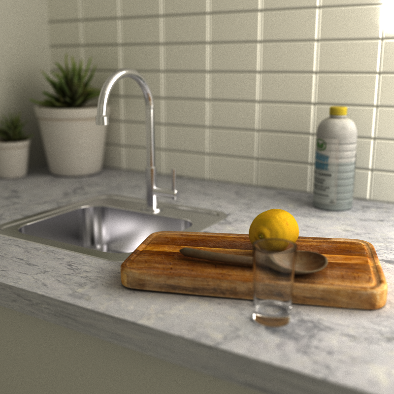

*A kitchen sink in afternoon light. Eight glTF models, 50 000 triangles, image and procedural textures, bump-mapped grout, brushed steel, glass, and a thin-lens camera focused on the cutting board. 800x800, 4000 samples per pixel, trace depth 16, about 210 ms per iteration.*

## Overview

The renderer parallelizes over *path segments*: the depth loop lives on the host, and each kernel launch advances every live path by exactly one bounce.
Path state sits in device-memory arrays between launches, which is what makes it possible to compact dead paths away and reorder live ones by material before shading.

One iteration of the pipeline looks like this:

```
generateRayFromCamera            one ray per pixel, jittered inside the pixel for AA
for depth in 0 .. DEPTH-1:
    computeIntersections         closest hit for every live path
    sort by materialId           toggleable, groups same-material paths together
    shadeMaterial                evaluate BSDF, update throughput, spawn next ray
    stream compaction            thrust::partition, drop terminated paths
    break if no paths remain
finalGather                      accumulate each path into its pixel via pixelIndex
```

Because compaction and sorting both shuffle the path array, every `PathSegment` carries its own `pixelIndex`, and that is the only thing that lets the final gather find its way home.

## Core pipeline

These are the pieces everything else is built on: the shading kernel, and the three stages that reshape the path array around it.

Every timing in this README is milliseconds per iteration at 800x800 unless a caption says otherwise, which is 640,000 paths per iteration, and changes one variable at a time. How each number was measured, with the raw readings, is in [`analysis/perf-data.md`](analysis/perf-data.md).

The three optimizations below were each measured on the same open Cornell box, a scene with seven primitives and two BSDFs.

| Feature | Effect on this scene |
|---|---|
| Stream compaction | +3.3 ms/iteration, 19% slower |
| Material sorting | +15.9 ms/iteration, 79% slower |
| Anti-aliasing | -0.29 ms, within measurement noise |

Two of the three cost more than they save here. That looks like a property of the scene rather than of the implementations: compaction and sorting target idle warp lanes and branch divergence, and a scene this simple has little of either, while the bandwidth they spend moving path segments around is the same either way. The sections below take each one in turn.

### Shading

Shading is done with a single kernel that branches on material type. 
- Ideal diffuse surfaces: use cosine-weighted hemisphere sampling, where the cosine term in the estimator and the cosine in the PDF cancel, so throughput is just multiplied by the surface albedo
- Perfect specular surfaces: reflect the incoming direction about the normal with no randomness at all
- Dielectric surfaces (glass, water): reflect or refract, chosen per bounce with the Schlick approximation of Fresnel, with total internal reflection handled explicitly
- Geometry: the base code's spheres and boxes plus triangle meshes loaded from glTF 2.0 with a hand-written loader, each mesh behind a toggleable bounding-box test

- Rays that miss the scene entirely, or that run out of bounces before finding the light -> black
- Rays that land on an emitter settle up immediately -> the accumulated throughput is multiplied by the emitted radiance and the path terminates

**Diffuse, against a reference render**

| This renderer, 5000 spp | Reference, 5000 spp |
|---|---|
| 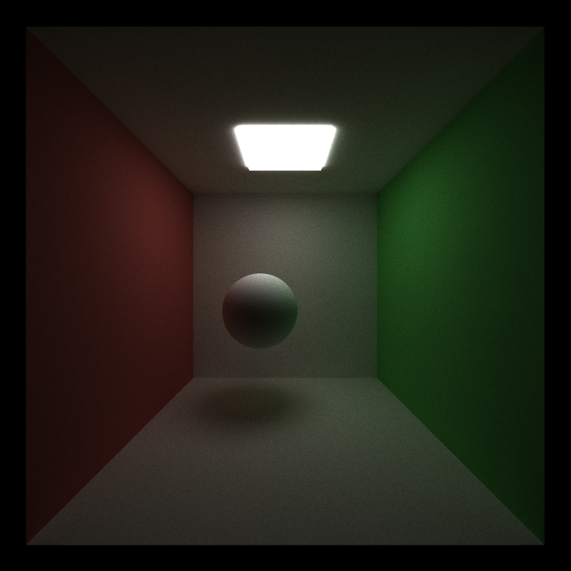 |  |

The render matches the reference on the two things that break first if the diffuse BSDF or the throughput bookkeeping is wrong: the color bleeding off the red and green walls, and the soft contact shadow under the sphere.

Per-pixel comparison: mean absolute difference 2.1 out of 255, global means equal to three decimals, and every 4x4 region mean within 0.07%. That is the Monte Carlo noise left at 5000 samples, not a systematic difference.

**Specular**

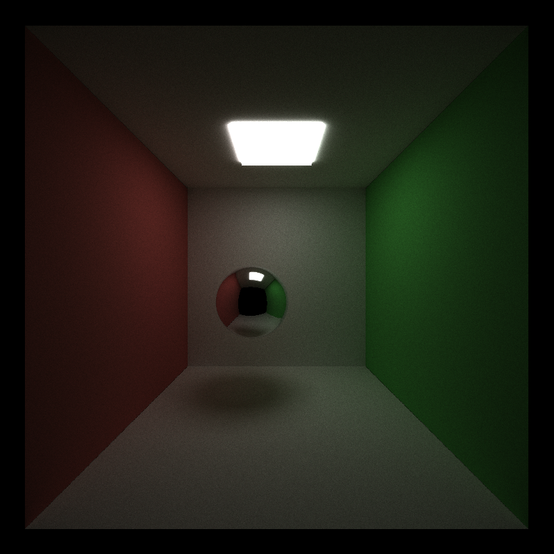

*Same scene, sphere switched to `Specular` with roughness 0. 800x800, 5000 spp, depth 8.*

- The mirror picks up the red and green walls and reflects the light straight back at the camera
- The dark disk in the middle is the camera's own line of sight leaving through the open front of the box -> nothing to hit -> black

### Stream compaction

#### Paths actually survive each bounce

Path counts are taken from iteration 1 of the open Cornell box:

| Bounce | Paths alive | Fraction of the original 640k |
|---|---|---|
| start | 640,000 | 100% |
| 1 | 523,164 | 82% |
| 2 | 362,150 | 57% |
| 3 | 279,680 | 44% |
| 4 | 222,899 | 35% |
| 5 | 180,366 | 28% |
| 6 | 146,600 | 23% |
| 7 | 119,912 | 19% |

- Between 18% and 31% of the surviving paths die at every bounce, either escaping the open front of the box or landing on the light. Bounce 2 is the outlier at 31%; the rest sit between 18% and 23%
- Without compaction all 640,000 threads launch at every depth anyway -> by the last bounce four out of five do nothing but read `remainingBounces`, see zero, and return

#### Compaction on versus off

| Configuration | avg ms/iteration | ~FPS |
|---|---|---|
| Compaction on (`thrust::partition`) | 20.40 | 49 |
| Compaction off | 17.09 | 59 |

Compaction is a net *loss* of 3.3 ms/iteration here, a 19% slowdown, which is the opposite of what the idle-thread argument predicts. That argument only counts the work saved, not the work added.

- Work saved is small: 7 primitives in the scene, so one bounce of intersection + shading is a handful of ray-box tests. A warp full of dead threads costs very little
- Work added is not: `thrust::partition` runs over the path array 8 times per iteration, physically moving 44-byte `PathSegment` structs through global memory
- The bandwidth spent shuffling outweighs the arithmetic it saves

The two configurations converge to the same image without being byte-identical. Over the 5000-sample pair the mean absolute difference is 1.5 out of 255 and the global means agree to three decimals, which is residual Monte Carlo noise rather than a disagreement.

They are not bit-exact because compaction moves a path into a different array slot, and the RNG is seeded per index, so the path draws a different random number than it would have uncompacted.

The balance should flip once per-ray work gets expensive, as it does with meshes, thousands of primitives and deeper traces: an idle warp slot then costs more while a partition costs the same. This comparison is one to re-measure once a BVH is in place.

#### Open versus closed scene

`scenes/core/cornell_closed.json` is the same room with a wall across the open front at z=+5 and the camera moved inside to sit just in front of it, so nothing can leave the scene.

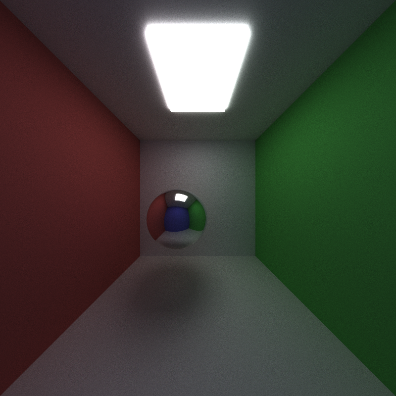

*The closed box at 5000 spp, 800x800, depth 8. The center of the mirror sphere used to be a black disk where the camera's own line of sight escaped through the open front; it now reflects the blue wall standing behind the camera, which is the quickest visual confirmation that the room is really sealed.*

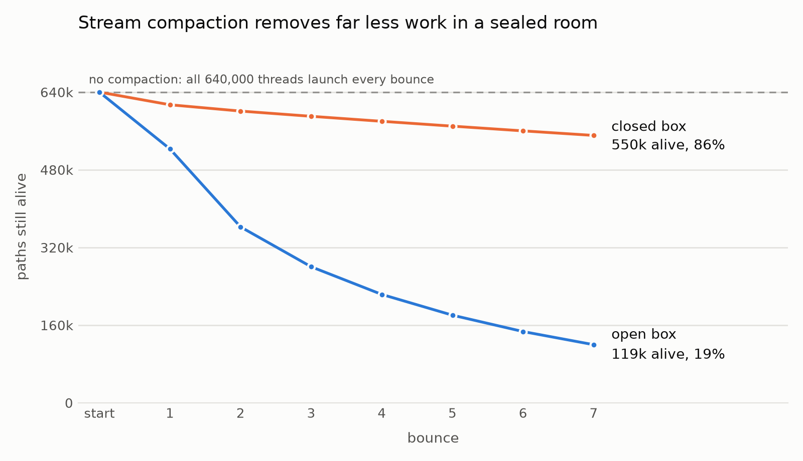

*Unterminated paths after each bounce of a single iteration. The dashed line is what runs when compaction is off, which is every thread at every depth in both scenes.*

| Bounce | Paths alive, open box | Paths alive, closed box |
|---|---|---|
| start | 640,000 (100%) | 640,000 (100%) |
| 1 | 523,164 (82%) | 613,916 (96%) |
| 2 | 362,150 (57%) | 601,084 (94%) |
| 3 | 279,680 (44%) | 590,284 (92%) |
| 4 | 222,899 (35%) | 580,254 (91%) |
| 5 | 180,366 (28%) | 570,499 (89%) |
| 6 | 146,600 (23%) | 560,637 (88%) |
| 7 | 119,912 (19%) | 551,106 (86%) |

| Configuration | Open box | Closed box |
|---|---|---|
| Compaction on | 20.40 ms, 49 FPS | 35.97 ms, 28 FPS |
| Compaction off | 17.09 ms, 59 FPS | 19.74 ms, 51 FPS |

Sealing the box removes the only cheap way for a path to die, and that turns compaction from a mild loss into a severe one.

- Compaction costs 3.3 ms/iteration in the open box and 16.2 ms in the closed one, a 19% slowdown against an 82% slowdown -> the same optimization is roughly five times more expensive once the room is sealed
- The path counts say why: `thrust::partition` pays for the length of the array it scans and moves. The open box collapses from 640k to 120k over eight bounces, so its later partitions are cheap. The closed box never falls below 551k, so every bounce moves nearly the whole array and deletes almost nothing
- With compaction off the two scenes are close, 17.09 against 19.74, because neither one shortens its launches and the sealed room only does a little more real intersection work -> most of the closed box's 35.97 ms is compaction's own overhead rather than the scene being intrinsically harder. One caveat on comparing the two scenes' absolute times: the closed box also moves the camera inside the room and widens the FOV from 45° to 60°, so its ray distribution differs; the on/off comparisons within each scene are unaffected
- The margin is wide enough to invert the ranking: the closed box with compaction off (19.74 ms) beats the open box with compaction on (20.40 ms)

### Material sorting

| Configuration | avg ms/iteration | ~FPS |
|---|---|---|
| Sort off | 20.11 | 50 |
| Sort on (`thrust::sort_by_key`) | 36.03 | 28 |

Both rows have compaction and anti-aliasing on, so sorting is the only variable. It costs 15.9 ms per iteration, a 79% slowdown.

- What it targets: warp divergence in the shading kernel, by making a warp's 32 threads hit the same material branch
- Why there is little to win here: `shadeMaterial` branches three ways (emitter, scatter, miss) and `scatterRay` splits again into diffuse and specular, none of them expensive -> almost no divergence to cure
- What it costs: a full `thrust::sort_by_key` over 20-byte intersection keys and 44-byte path values, up to 640k elements, at every one of the 8 bounces
- When it would pay: many materials with genuinely different shading costs, so an unsorted warp stalls on its slowest thread: refraction with Fresnel, texture lookups, a microfacet BSDF

One detail is worth flagging. The paths-alive counts shift slightly when sorting is on, for instance 362,755 against 362,150 at bounce 2. This is most likely because sorting moves a path into a different array slot while the RNG is seeded per index, so the path draws a different random number than it would have unsorted. The two runs are statistically equivalent and converge to the same image.

### Anti-aliasing

Each camera ray is jittered by a uniform random offset inside its pixel footprint, so over 5000 iterations every pixel integrates its whole area instead of one fixed point. 

Cost: seeding one RNG per ray in the generation kernel and drawing from it twice, once for the x offset and once for the y.

Note that pictures below are 4x nearest-neighbor blowups, so the pixel grid stays visible:

| | AA off | AA on |
|---|---|---|
| Sphere silhouette | 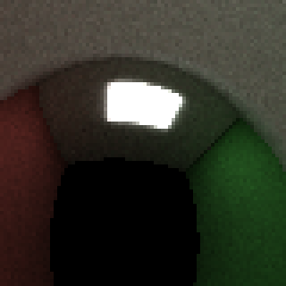 | 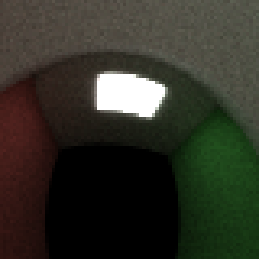 |
| Light fixture edge | 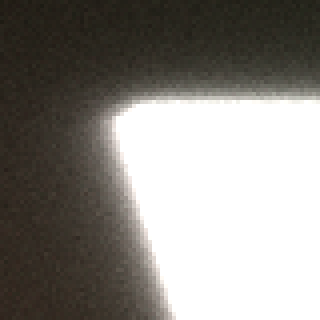 | 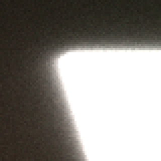 |

The sphere pair clearly shows that without jitter the silhouette is a hard staircase of fully-lit and fully-dark pixels; with jitter the boundary pixels land in between, in proportion to how much of the sphere actually covers them.

| Configuration | avg ms/iteration | range over 50 blocks | ~FPS |
|---|---|---|---|
| Compaction on, sorting off, AA off | 20.40 | 19.65 to 21.19 | 49 |
| Compaction on, sorting off, AA on | 20.11 | 19.50 to 21.31 | 50 |

The difference is -0.29 ms, meaning the run with jitter came out marginally *faster*, and the two ranges overlap almost entirely. The cost of anti-aliasing is smaller than the run-to-run spread of either run, so this measurement cannot separate it from zero. What it does establish is a bound: whatever AA costs, it is well under 1.5% of a frame.

That is where the work sits, too. The jitter is two random draws in the ray generation kernel, which runs once per iteration, while frame time is dominated by the eight-deep bounce loop that anti-aliasing never touches. It buys a visibly better silhouette for a cost this measurement cannot see.

An earlier run had put the cost at 3 to 9 ms. That measurement was contaminated: re-running the same three toggles gave 36.03 ms against the 40.5 to 45.9 ms first recorded, so the earlier figure is discarded rather than reported.

### The core pipeline on a GPU versus a CPU

A single-threaded CPU tracer would take minutes per frame instead of milliseconds, and two of the three optimizations above would be pointless on it.

- Stream compaction: exists because GPU threads run in lockstep warps and an idle lane is wasted silicon. A CPU loop skips a dead path with a branch that costs next to nothing
- Material sorting: exists because a diverging warp serializes its branches. A CPU core takes the branch it needs and moves on
- Anti-aliasing: transfers unchanged, same cost on either side

## Features

### Mesh loading

Meshes come in as glTF 2.0 through a loader written from scratch on the `json.hpp` and `stb_image.h` the base code already ships.

How a `.gltf` is read:
- The JSON is an index over a raw `.bin` blob: attribute -> accessor -> bufferView -> byte range
- POSITION, NORMAL, TEXCOORD_0 and the index buffer are each `start byte + i * stride`, reinterpreted as float, uint16 or uint32
- Every triangle is transformed into world space at load time with the scene's `TRANS` / `ROTAT` / `SCALE`, normals through the inverse transpose
- Every primitive of every mesh in the file goes into the same geom, so a model exported in parts (pot, soil, plant) loads as one object. Node transforms are not applied, so the parts must be exported in place
- All triangles live in one flat device array; a mesh geom is a `[triStart, triCount)` range into it

World-space triangles mean the intersection kernel never inverse-transforms a ray, and the bounding box below (later a BVH) is built directly in world space.

Intersection is Moller-Trumbore with one change: the glm version culls back faces, which is fatal for refraction, where a ray has to hit the inside of the mesh it is leaving. The renderer uses its own copy that only rejects the parallel case. Normals are interpolated from the three vertex normals, so smooth-shaded exports render smooth.

| Native cube vs glTF cube | Suzanne, 15 744 triangles |
|---|---|
| 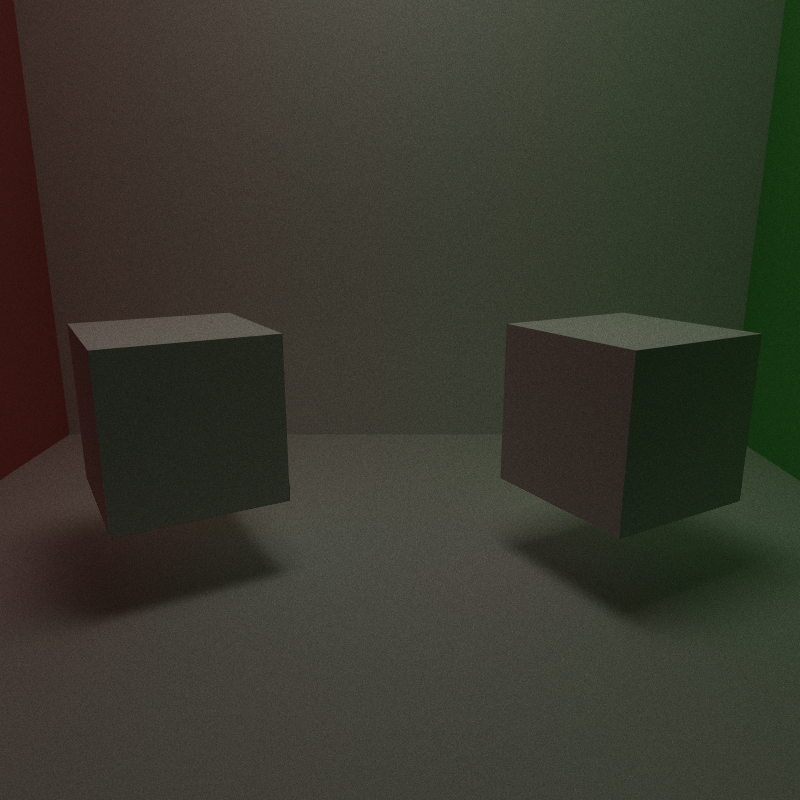 | 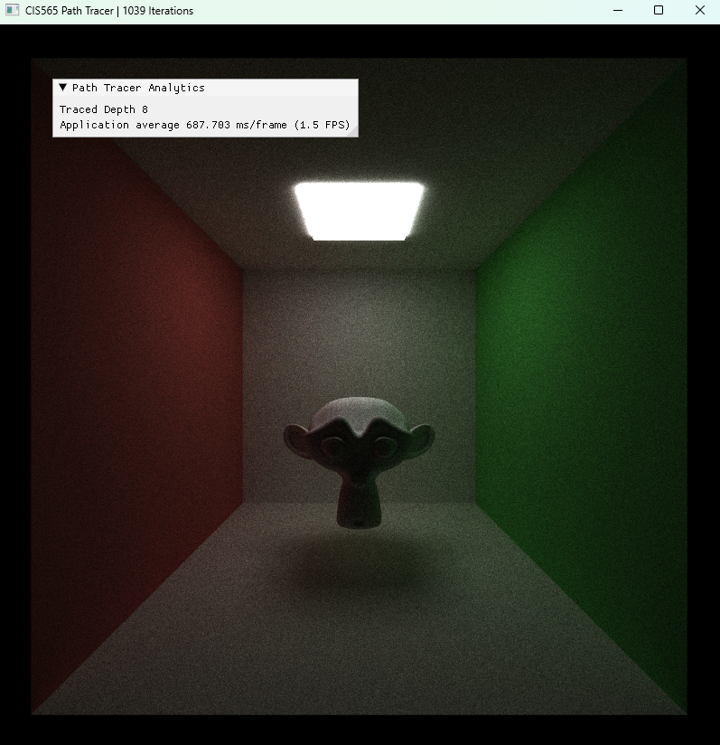 |

*Left: the base code's cube beside the same cube from a Blender glTF export, same material, rotation and scale, 5000 spp. Right: Suzanne with two subdivision levels, 1000 spp, depth 8.*

Correctness check: a slightly larger red mesh cube placed exactly on top of the native one rendered as a solid red cube with no white poking through, which pins down the transform, the winding and the intersection at once.

#### Bounding-box culling

Each mesh keeps the world-space AABB of its triangles. With `MESH_AABB_CULL` on, a ray does a slab test first and skips the whole triangle loop on a miss. Suzanne at two triangle counts:

| Model | Triangles | Culling off | Culling on | Speedup |
|---|---|---|---|---|
| suzanne_4k | 3 936 | 408.6 ms | 282.6 ms | 1.45x |
| suzanne_16k | 15 744 | 1591.5 ms | 1045.6 ms | 1.52x |

*100 iterations, BVH off, all other toggles on.*

- Time grows close to linearly with triangle count: four times the triangles cost 3.7x with culling and 3.9x without, because without an acceleration structure every ray that reaches the box still tests every triangle
- The box saves about a third because Suzanne fills the middle of the frame, so nearly every primary ray hits it anyway; the savings come from secondary rays leaving the walls in other directions
- 1 fps at 16k triangles is the number the BVH in the next section has to beat

#### Mesh loading on a GPU versus a CPU

A CPU path tracer would load the glTF the same way; the difference is in traversal.
- The GPU wins on raw throughput: every live path tests the mesh at once, so 1 fps at 16k triangles is still up to 640k paths each testing 15,744 triangles per bounce
- The GPU loses on divergence: threads in a warp run in lockstep, so a thread whose ray missed the bounding box still waits while its neighbors walk the whole triangle loop. The box test saves that thread's arithmetic but not its time. A CPU core skips the loop the moment its own ray misses

#### Where mesh loading goes next

- Apply the node transforms in the file, so models do not have to be re-exported with transforms baked in
- Read the material and texture the file names, instead of assigning them in the scene JSON

### Bounding volume hierarchy

Bounding-box culling only decides whether a ray tests a mesh at all. The BVH decides which of its triangles: each mesh gets a tree of boxes, and a ray walks down only the branches it touches.

Building, on the CPU at load time:
- A node holds the box around its triangles. A node with more than four triangles is split in two and the halves become its children
- The split is a median split: sort the node's triangles by centroid along the axis on which the centroids spread the widest, and cut the list in half. `std::nth_element` does the partial sort in linear time
- Splitting by count keeps the tree balanced no matter how the triangles are placed, so its depth is `log2(triangles / 4)`: 12 levels for Suzanne. A depth limit, `bvhMaxDepth`, caps it anyway so the traversal stack can be sized
- Triangles are reordered in place, so every node owns one contiguous slice of the same flat array the intersection kernel already reads. The nodes of all meshes sit in one array too, and a geom stores the index of its root

Traversal, on the GPU:
- No recursion. A 32-entry stack in registers holds the nodes still to visit; pop one, test the ray against its box, push both children or test the leaf's triangles
- The leaf test is the same loop as before, over four triangles instead of thousands
- `BVH` toggles it; off falls back to the single box per mesh

| Scene | Triangles | One box per mesh | BVH | Speedup |
|---|---|---|---|---|
| suzanne_4k | 3 936 | 280.4 ms | 48.1 ms | 5.8x |
| suzanne_16k | 15 744 | 1068.6 ms | 49.0 ms | 21.8x |
| kitchen, 5 models | 25 653 | 333.0 ms | 33.5 ms | 9.9x |

*300 iterations each, 800x800 for Suzanne and 400x400 for the kitchen, all other toggles on. The one-box column matches the culling-on column of the table above, measured the same day.*

- With the BVH, four times the triangles cost 1 ms more. Without it they cost 3.8x as much. The walk is logarithmic in triangle count, the loop is linear
- Suzanne at 49 ms is within a few ms of the Cornell box without a mesh, so the mesh is no longer the expensive part of the frame
- The kitchen gains less than Suzanne because its five meshes are small on screen and most rays miss them at the root box, where the two versions do the same work

#### The BVH on a GPU versus a CPU

- The GPU still wins on throughput, and by a wider margin than before: the per-ray work shrank from thousands of triangle tests to a few dozen box tests, so the same launch finishes much sooner
- Divergence is where it suffers. Two rays in a warp walk different branches, so each one waits at every step for the other's box test, and a warp is only as fast as its deepest ray. A CPU core walks its own tree and stops the moment its own ray is done
- Recursion would be the natural CPU shape; the GPU version keeps its own stack because a device function cannot recurse without spilling to slow local memory

#### Where the BVH goes next

- Visit the nearer child first and stop once the current best hit is closer than the next box, which turns a full walk into an early exit
- A surface-area heuristic instead of the median, which puts the split where it cuts the most empty space
- A top-level BVH over the objects in the scene, so the kernel stops looping over every geom

### Refraction

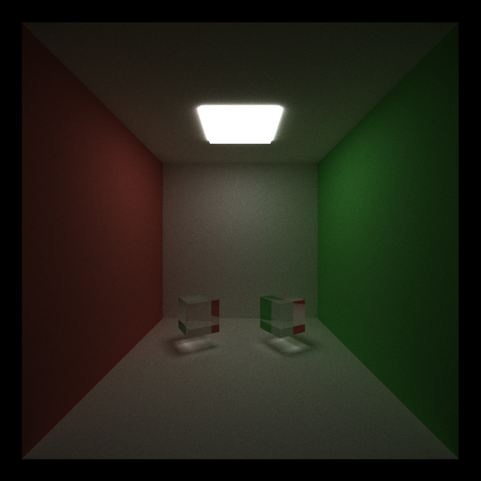

*Two glass cubes, IOR 1.5: the native box on the left, the same cube loaded from glTF on the right. 800x800, 5000 spp, depth 32. The red and green on their side faces are the walls seen by total internal reflection.*

Dielectrics are the third material type. Per hit:
- Entering or leaving is decided from the sign of `dot(direction, normal)`; the normal is flipped to face the ray
- The index ratio follows: air to glass on the way in, glass to air on the way out
- Schlick gives the reflectance R for that angle; the path reflects with probability R and refracts with probability 1 - R, which keeps the estimator unbiased with no division by the pick probability
- Total internal reflection is detected from the Snell discriminant directly rather than from `glm::refract`, for a reason in the bloopers

| | Mirror | Glass, IOR 1.5 |
|---|---|---|
| Open box |  | 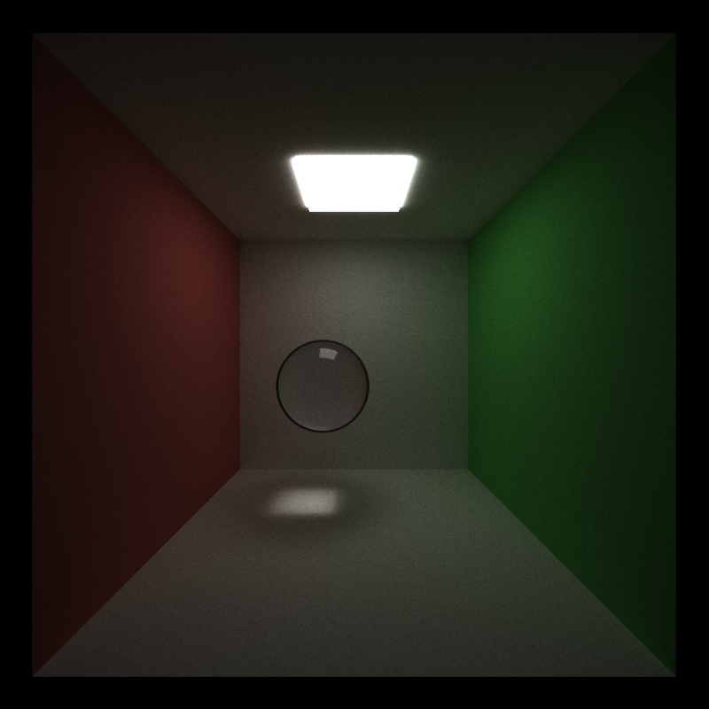 |
| Closed box |  | 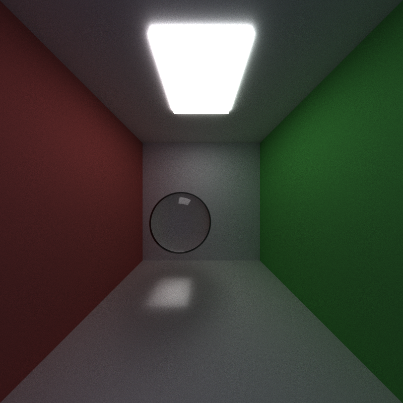 |

*Each row is one scene file with only the sphere's material changed. 800x800, 5000 spp, depth 8. The closed box adds a blue wall behind the camera and moves the camera inside the room.*

What the glass sphere has to get right:
- The room appears upside down and mirrored inside it: the red wall shows up on the right
- The light is focused into a bright caustic on the floor, with the sphere's shadow around it
- A faint highlight on top is the 4% Fresnel reflection at normal incidence

The dark rim is not a bug. In the open box, rays that reflect off the rim at grazing angles or refract through it at large deflections look out the open front and see nothing. In the closed box the rim thins to what a real glass sphere shows in a dim room: the compressed image of its own shadow and the unlit ceiling.

A glass *mesh* needed two more fixes, both in the bloopers: the box intersection's inside-hit normals disagreed with spheres and meshes, and this repo's glm returns NaN on total internal reflection.

#### Refraction performance

The same sphere as a mirror and as glass, in both boxes:

| Box | Mirror | Glass | Difference |
|---|---|---|---|
| Open | 37.0 ms | 37.4 ms | +1.1% |
| Closed | 64.8 ms | 65.5 ms | +1.0% |

The material's cost is below what this measurement resolves at this scale. A dielectric hit costs one Schlick evaluation, one discriminant and one random draw more than a mirror hit, and the sphere covers under a tenth of the frame. The closed box is slower in both columns because paths there cannot escape and mostly run to the depth limit, which is the stream compaction story above, not the material's.

No acceleration was attempted: there is little to amortize when the extra work is a handful of multiplies per hit.

The cost that does show up with glass is indirect: it wants a deeper trace. The glass scenes at depth 8 and 32:

| Box | Depth 8 | Depth 32 | Ratio |
|---|---|---|---|
| Open | 37.1 ms | 55.7 ms | 1.5x |
| Closed | 65.0 ms | 219.1 ms | 3.4x |

- Open box: four times the depth costs half again as much, because most paths leave through the open front within a few bounces and compaction removes them from every later launch
- Closed box: nothing escapes, so paths only end by hitting the light, and nearly every extra bounce is paid for in full

#### Refraction on a GPU versus a CPU

- The per-hit arithmetic is the same on both, so the material itself neither benefits nor suffers
- Where the GPU suffers is branching: reflect-or-refract is a random choice per path, so a warp that shades glass takes both branches. That only matters when many paths in a warp are glass, which material sorting is meant to arrange, and the 1% above says it is not yet worth worrying about
- Extra depth is where the GPU benefits, but only when paths die: compaction shrinks each launch, so depth 32 costs 1.5x depth 8 in the open box. In the closed box it costs 3.4x, close to the 4x a CPU would pay, because there is nothing to compact

#### Where refraction goes next

- Russian roulette instead of a fixed depth limit
- Water inside glass, which needs to know which material the ray is already in
- Rough glass

### Texture mapping

| Nearest texel | Bilinear |
|---|---|
| 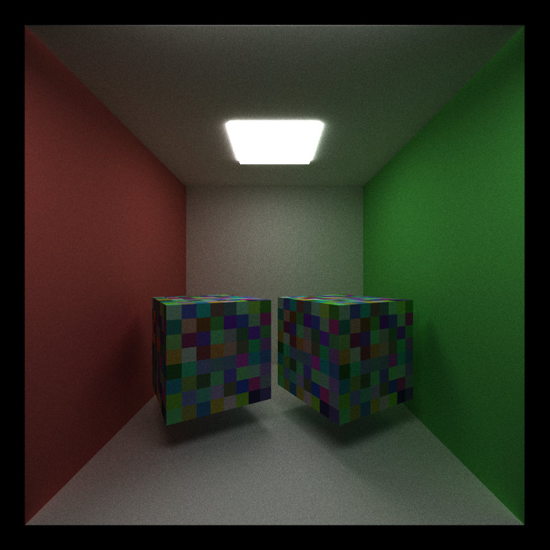 | 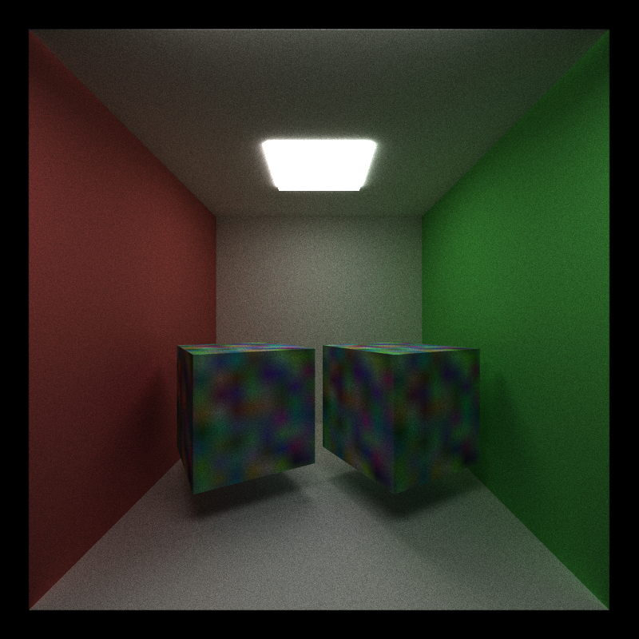 |

*An 8 x 8 pixel image stretched over two cubes, the base code's box on the left and a glTF cube on the right. 800x800, about 3000 and 2000 spp.*

A material can take its base color from an image or from a formula instead of a constant. Both work on loaded meshes and on the base code's boxes.

How a color gets from the image to the hit:
- The triangle test interpolates the three vertex UVs with the same barycentric weights it already uses for normals, and the UV travels in `ShadeableIntersection` to the shading kernel
- Boxes have no UVs of their own, so the box test computes them from the object-space hit point: drop the axis the face normal points along, shift the other two by 0.5. Each face is oriented as seen from outside, checked with `right x up = outward normal`
- Every image is decoded with `stb_image` and appended to one flat array of texels. A small table records each image's `offset`, `width` and `height`, and a material stores an index into that table
- The kernel takes two pointers no matter how many images the scene has, the same layout as the triangle array and its per-mesh ranges
- Sampling wraps UVs, then either takes the nearest texel or blends the four around the sample point, behind `TEXTURE_BILINEAR`

| Plain | Image texture | UV debug view |
|---|---|---|
|  | 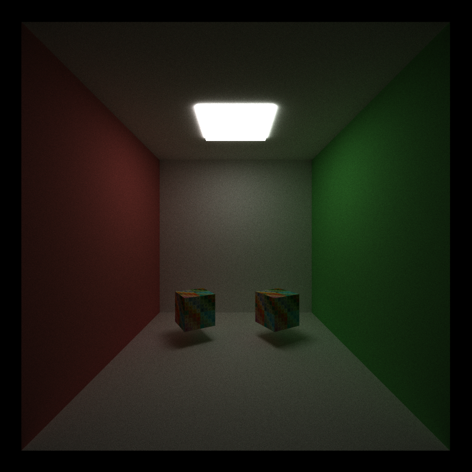 | 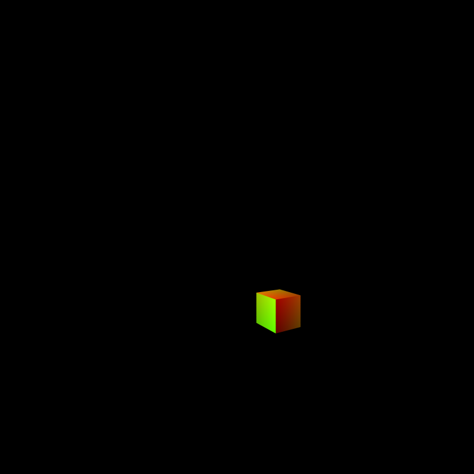 |

*Same layout, same camera. The textured glTF cube has one full UV square per face. The debug view paints (u, v, 0) on the first hit of a cube with Blender's default cross unwrap, where each face covers a sixteenth of the image.*

#### Procedural tiles

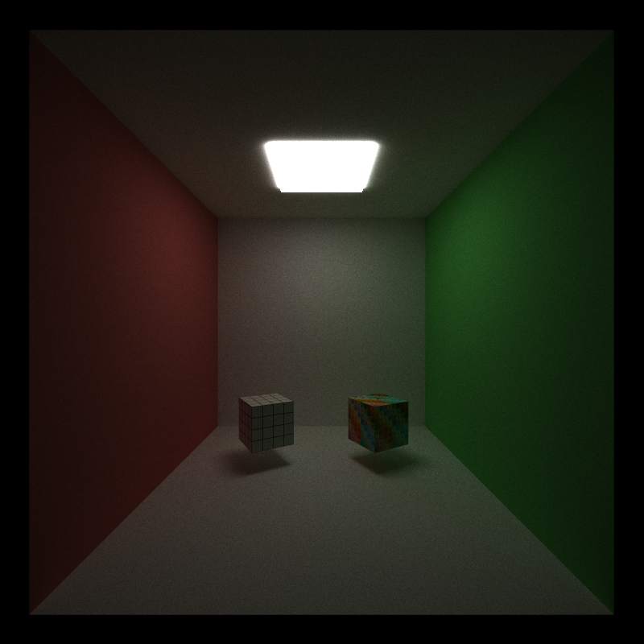

*Left: tiles computed in the shader, 4 x 4 per face. Right: the UV checker image. 5000 spp.*

The tile pattern is three lines of arithmetic on the UV:
- Scale by the tile count and keep the fractional part, which is the position inside the current tile
- Take the distance to the nearest tile edge on each axis
- Closer than half a grout width on either axis is grout, anything else is tile

It needs no memory, and it stays sharp at any distance because there are no texels to run out of.

#### Texture mapping performance

One Cornell box, all five walls sharing one material so that most hits on every bounce sample it, rendered three ways:

| Wall material | ms/iteration |
|---|---|
| Flat color | 44.9 |
| Image, 2048 x 2048 | 43.9 |
| Procedural tiles | 44.1 |

- The three are within 1 ms, and the untextured walls are the slowest, so the differences are not the cost of texturing
- The same scene moves by more than that from one run to the next: the procedural walls read 39.9, 46.8 and 44.1 ms on three runs
- A path samples at most once per bounce, next to an intersection test against every object, a sort and a partition

Texturing has no cost this measurement can see. For the same reason no acceleration was attempted: CUDA texture objects would move filtering into hardware, but there is no measurable cost for them to remove.

#### Texture mapping on a GPU versus a CPU

- The lookup is the same arithmetic on both
- Memory access is where they could differ: neighboring threads in a warp hit unrelated points, so their texel reads land far apart in a 50 MB array. None of that showed up in the timings
- The branch between image, procedural and plain is per material, so material sorting lines a warp up on one of them. With no measurable cost there is little for it to recover

#### Where texture mapping goes next

- Mipmaps, so distant textures do not shimmer
- Store texels as bytes instead of floats: the 4096 x 4096 checker takes 201 MB today
- A procedural marble

### Bump mapping

| Bump off | Bump on |
|---|---|
| 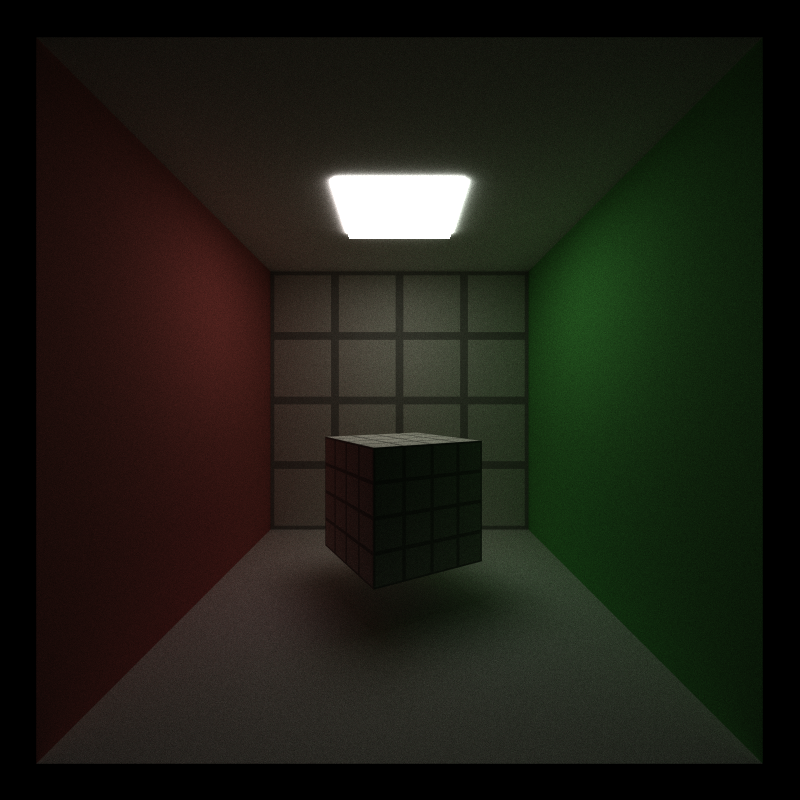 | 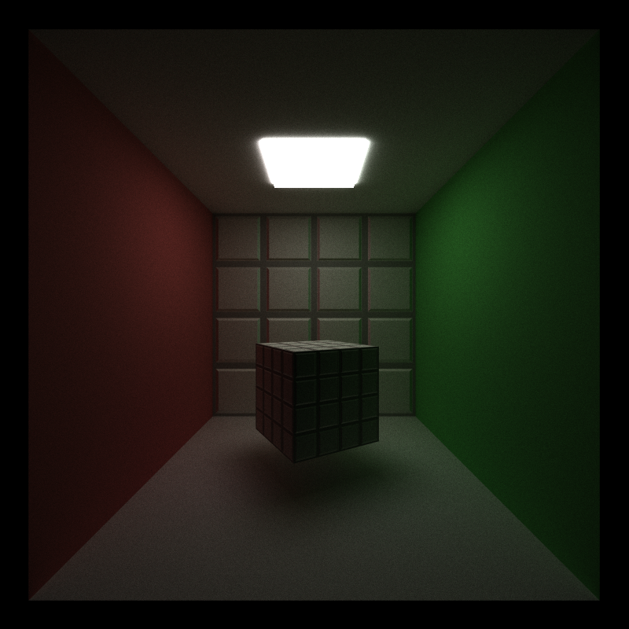 |

*Procedural tiles on the back wall and the cube. 800x800, 5000 spp, depth 8. The geometry is identical in both; only the normal used for shading changes.*

The tile pattern already knows where the grout is, so it can also say how high the surface is: 1 on a tile, 0 in the grout, a short ramp between. Bump mapping turns the slope of that height into a tilt of the normal.

- Every hit carries a tangent, the direction in which u grows. Boxes take it from the face, triangles solve for it from their edges and UVs
- The height is sampled at the hit and one small step away along u and along v, which gives the slope in both directions
- The normal tilts away from uphill: `n' = normalize(N - strength * (hu * T + hv * B))`
- A tilted normal can scatter a ray under the real surface. Those directions are mirrored back above it, see the bloopers for what happens without that

| Tangent | Bumped normal |
|---|---|
| 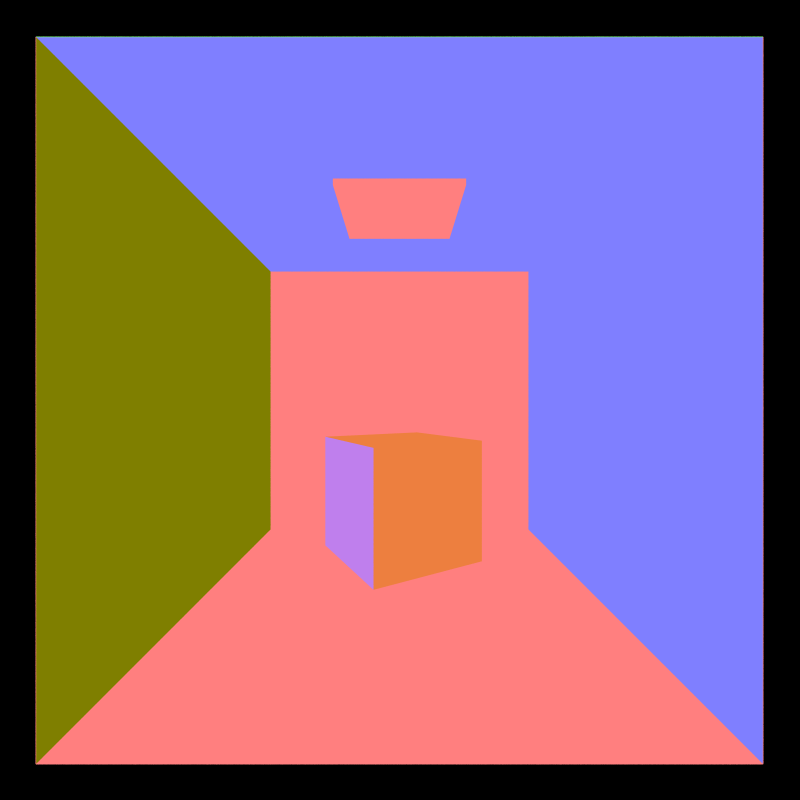 | 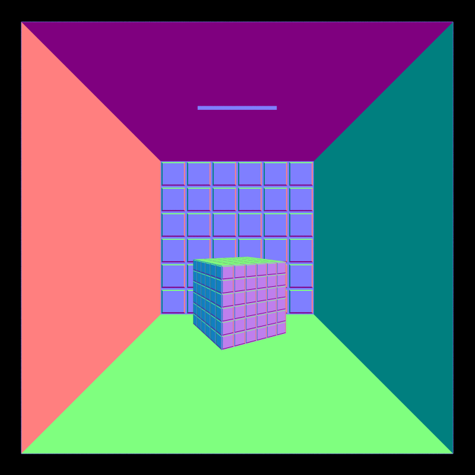 |

*Debug views, direction mapped to color. The tangent turns with the cube. In the normal view each tile is flat and only the ramps change color, opposite sides in opposite colors, which is what a groove looks like.*

What the render shows, in pixel values from 0 to 255:

| Tile edge | Bump off | Bump on |
|---|---|---|
| Facing the light | 50 | 53 |
| Facing away from it | 49 | 31 |
| Facing the green wall, green channel | 50 | 62 |

The edge that faces the green wall turns green. Bump mapping only changes a direction, and global illumination does the rest.

#### Bump mapping performance

The tiled Cornell box from the texture section, with and without bump:

| Walls | ms/iteration |
|---|---|
| Procedural tiles | 46.8 |
| Procedural tiles with bump | 46.6 |

- The two cannot be told apart: readings in one row spread by up to 3.4 ms and the rows differ by 0.2 ms
- Bump costs three evaluations of the height function per hit, a few dozen multiplies
- No acceleration was attempted

#### Bump mapping on a GPU versus a CPU

- Same arithmetic on both, and no memory access at all since the height is computed
- It adds one branch per hit, bumped or not, which sorting by material already groups

#### Where bump mapping goes next

- Express the strength as an angle. Today the right value depends on the tile count and grout width
- Height from a grayscale image, for brushed metal
- Normal maps, which most downloadable materials ship with

### Direct lighting

| | Off | On |
|---|---|---|
| Depth 2 | 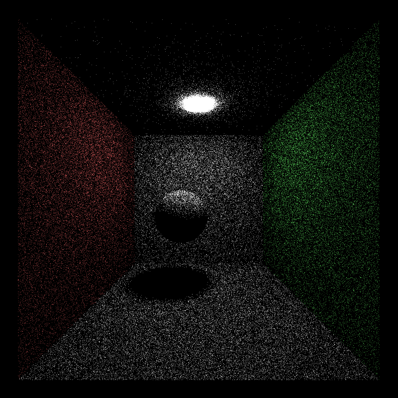 | 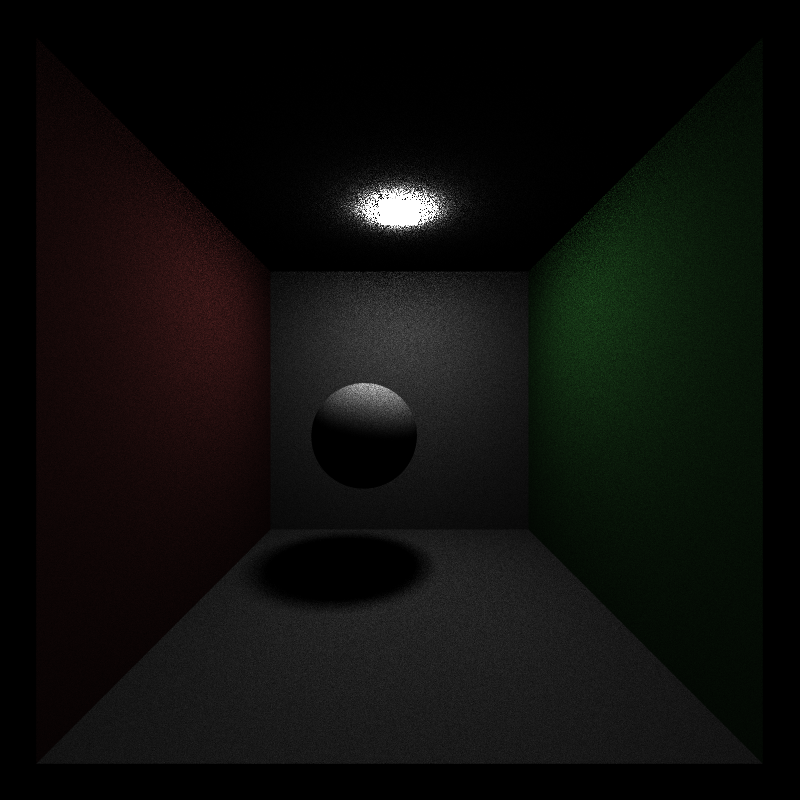 |
| Depth 8 | 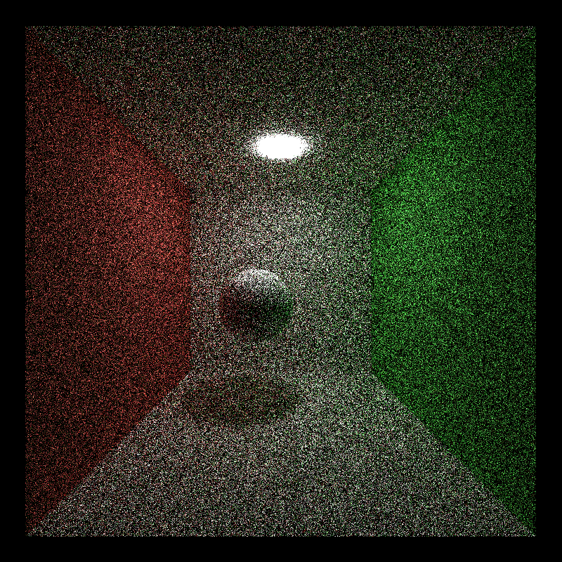 | 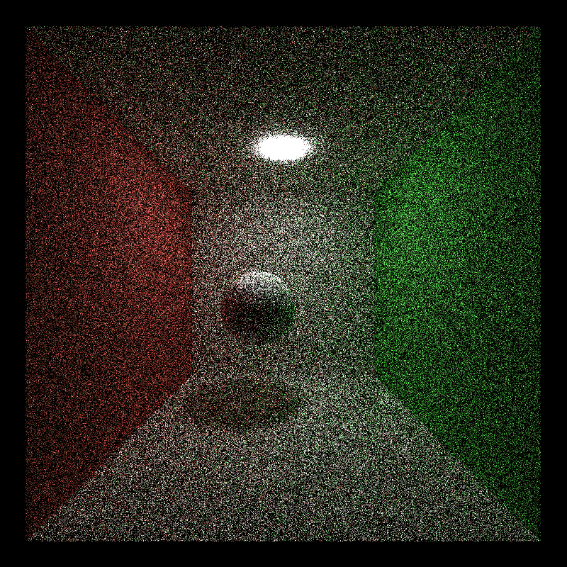 |

*A Cornell box with the light shrunk to a ninth of its area and made nine times brighter. 800x800, 100 spp in all four. The light is a square box; the oval around it is the ceiling next to it, lit from so close that it clips to white.*

A path only counts when it happens to reach a light. With a small light most paths miss, and the image is noise. Direct lighting stops leaving the last step to chance: the last ray of a path is aimed at a random point on a light.

- The scene loader keeps a list of the emissive boxes
- One light is picked, then a point on its surface, uniformly by area
- The ray goes to that point, and the next intersection pass finds out whether anything is in the way, so no separate shadow test is needed
- The path is reweighted for having chosen that direction: `albedo / pi * cosSurface * cosLight / distance^2 * lightArea * lightCount`

Noise on the floor, as the mean difference between neighboring pixels, in pixel values from 0 to 255:

| | Off | On |
|---|---|---|
| Depth 2 | 46.8 | 4.9 |
| Depth 8 | 77.8 | 77.4 |

- At depth 2 the noise drops to a tenth, and the frame is as bright as before, 13.6 against 13.7, which is how the weight was checked
- At depth 8 the noise moves from 77.8 to 77.4, which is no change this measurement can see. Only the last ray is aimed, and only a fifth of the paths live long enough to cast it. The noise comes from paths that reach the light by chance on earlier bounces

#### Direct lighting performance

| | Off | On |
|---|---|---|
| Depth 2 | 20.4 ms | 20.1 ms |
| Depth 8 | 44.7 ms | 45.2 ms |

- The rows differ by 0.3 and 0.5 ms, under the run-to-run spread, which fits the design: the aimed ray replaces the random one, so the number of rays is the same
- No acceleration was attempted

#### Direct lighting on a GPU versus a CPU

- The arithmetic is the same on both
- Reusing the next intersection pass as the shadow test suits the GPU: the kernel stays the same size and no thread traces a ray the others do not
- A CPU tracer would cast the shadow ray on the spot, which is simpler and works at every bounce

#### Where direct lighting goes next

- Aim a ray at the light on every bounce, not just the last one. That is what would help at depth 8
- Mix light sampling with random sampling, which removes the bright specks right next to the light
- Lights of any shape, not only boxes

### Imperfect specular

| Perfect mirror | Exponent 5000 | Exponent 500 | Exponent 50 |
|---|---|---|---|
| 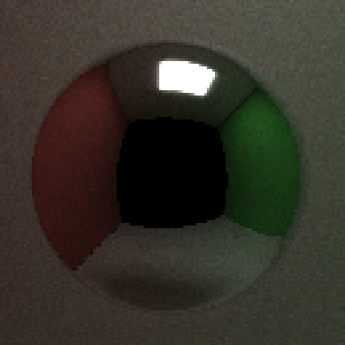 | 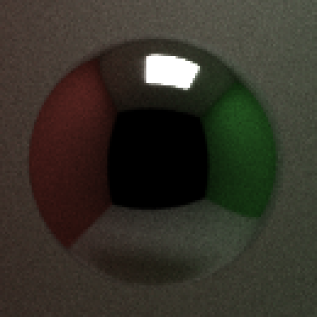 | 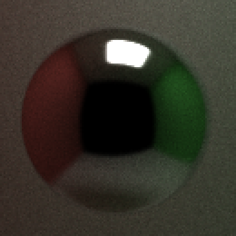 | 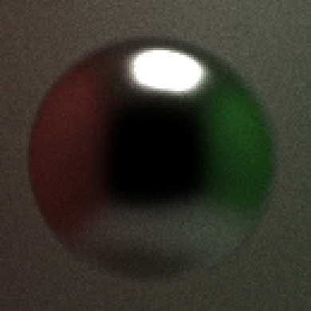 |

*The same sphere at four settings of the Phong exponent, cut out of the 800x800 renders and blown up 3x. 5000 spp. From left to right the reflection of the light goes from a sharp rectangle to a soft glow, and the walls from two flat colors to two smears; the full frames are in `img/specular_*.png`.*

A perfect mirror sends every ray in exactly one direction. A brushed or worn surface spreads them around that direction, tighter the shinier it is. The spread is a Phong lobe, sampled the way GPU Gems 3 chapter 20 gives it:
- Two random numbers become an angle off the mirror direction, `theta = acos(xi1 ^ (1 / (n + 1)))`, and an angle around it, `phi = 2 pi xi2`
- The direction is assembled in a frame whose z axis is the mirror direction and carried into world space
- The exponent `n` comes from the material as `EXPONENT`; leaving it out keeps the mirror
- A direction that lands under the surface is mirrored back above it, the same guard bump mapping uses

The sink and faucet in the kitchen use an exponent of 200. As a perfect mirror the basin turned into a shattered reflection of itself, which is in the bloopers.

| Perfect mirror | Exponent 200 |
|---|---|
| 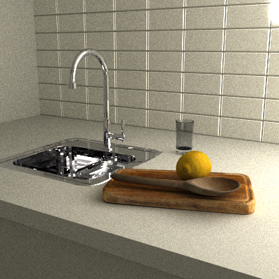 | 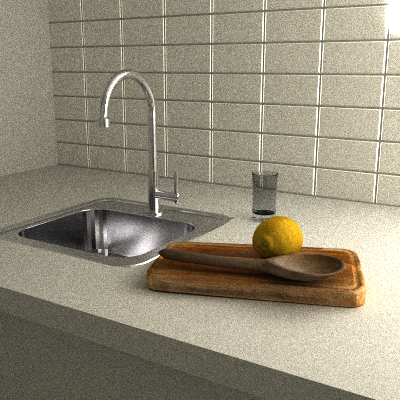 |

#### Imperfect specular performance

| Material | ms/iteration |
|---|---|
| Perfect mirror | 44.6 |
| Exponent 5000 | 45.6 |
| Exponent 500 | 45.8 |
| Exponent 50 | 45.9 |

*The Cornell mirror sphere scene, 300 iterations each.*

- The three lobes are within 0.3 ms of each other and about 1 ms, or 3%, over the mirror, under the 5% this measurement resolves. An earlier run of the same script had them 1 ms under the mirror. The sphere covers a tenth of the frame and the extra work is a few operations per hit
- No acceleration was attempted: a hit costs two random draws, one `pow` and four trigonometric calls more than a mirror hit

#### Imperfect specular on a GPU versus a CPU

- The arithmetic is the same on both, and it is a fixed amount of work per hit with no loop and no data-dependent branch, which is the kind of code a GPU likes
- Where the sphere is, the frame is one material either way, so material sorting has nothing new to line up

#### Where imperfect specular goes next

- Normalize the lobe, so a rough surface reflects the same total energy as a smooth one instead of slightly less
- A microfacet model such as GGX, whose highlights have the long tails real metal shows
- Roughness from a texture, so a surface can be worn in patches

### Depth of field

| Pinhole | Lens radius 0.09 | Lens radius 0.2 |
|---|---|---|
| 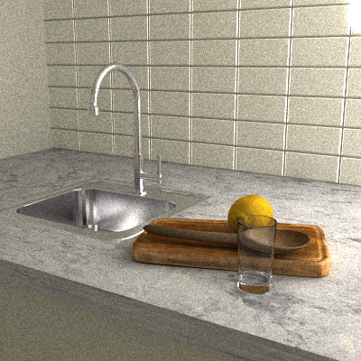 |  |  |

*The kitchen focused 9 units in, just behind the lemon. 400x400 at the two ends, 800x800 in the middle. The larger lens is what a real 4 cm aperture would do this close; the final image uses about 2 cm.*

The camera is a thin lens: rays start from a disk instead of a point, and all rays for one pixel pass through the same point on the plane of focus.
- The point of focus is where the pinhole ray crosses the plane `FOCAL_DISTANCE` in front of the camera, measured along the view direction, so rays toward the edge of the frame travel farther to reach it
- The ray origin moves to a uniformly random point on a disk of radius `LENS_RADIUS` in the camera's right and up directions, and the ray is re-aimed at the point of focus. The disk sample takes the square root of one random number as its radius, otherwise the samples crowd the center
- The lens sample is seeded apart from the anti-aliasing jitter so the two do not move together
- A scene without the two keys renders as before

#### Depth of field performance

| Lens radius | ms/iteration |
|---|---|
| 0 | 204.7 |
| 0.09 | 208.4 |

*The kitchen scene, 800x800, 300 iterations each.*

- Under 2%, at the edge of what the timing resolves. If it is real, it is not the lens arithmetic but the rays: a blurred pixel's rays fan out and hit different objects, so neighboring threads stop sharing the same branch of the BVH
- The real cost is not per iteration but in the number of iterations: a blurred region averages over more of the scene, so it needs more samples to reach the same noise level. The final image took 4000
- No acceleration was attempted: two random draws and a re-aim per primary ray

#### Depth of field on a GPU versus a CPU

- All of it happens in the ray generation kernel, once per pixel per iteration, and it is the same arithmetic on either side
- It should add no divergence: every thread takes the same path through the code, only with different random numbers

#### Where depth of field goes next

- Pick the focus by clicking a pixel, using the first hit's distance
- A shaped aperture, so the out-of-focus highlights take the shape of a real lens's blades

### The kitchen scene

The final image was built up in steps, each one a render that could be checked before the next.

| Gray models | Materials | Marble and glass | Final |
|---|---|---|---|
| 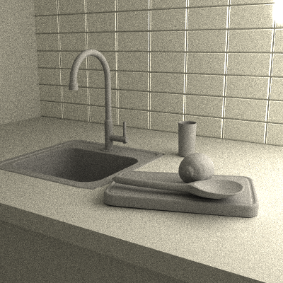 |  |  |  |

The room is primitives: a counter cut into four boxes around the sink so the basin has somewhere to go, a tiled backsplash with the procedural tiles and bump mapping, two emissive panels standing in for windows.
- Eight models: the sink with its faucet, the glass, the cutting board, the lemon, the spoon, the bottle and two potted plants, 50 000 triangles in all
- Scene units are 10 cm, so a model in meters takes `SCALE 10`
- Trace depth 16, because a ray through the glass crosses four surfaces before it sees anything, and at depth 8 the glass rendered as a gray lump

#### Scene file additions

The base code's JSON format is kept, with these keys added. Every one is optional.

| Where | Key | Meaning |
|---|---|---|
| Object | `"TYPE": "mesh"`, `FILE` | A glTF file, path relative to the scene file |
| Object | `NAME` | A label, ignored by the loader |
| Material | `TEXTURE` | An image for the base color, path relative to the scene file |
| Material | `PROCEDURAL`, `TILES`, `GROUT`, `GROUT_RGB` | The tile pattern: tiles per UV unit, grout width as a fraction of a tile, grout color. `TILES` and `GROUT` take one number or `[u, v]` |
| Material | `BUMP` | Bump strength on the tile pattern, 0 or absent turns it off |
| Material | `EXPONENT` | Phong exponent on a `Specular` material, absent keeps a perfect mirror |
| Material | `IOR` | Index of refraction on a `Refractive` material |
| Camera | `LENS_RADIUS`, `FOCAL_DISTANCE` | The thin lens, absent keeps the pinhole |

## Bloopers

### The Blender cube that was twice the size

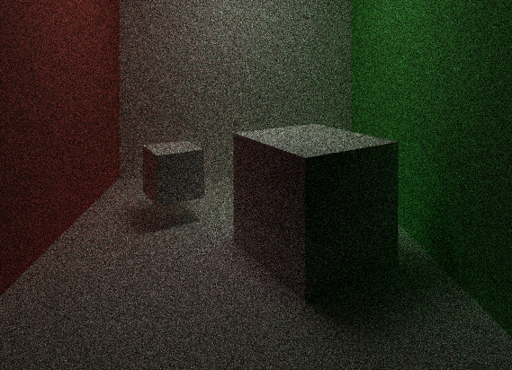

*First render with a loaded glTF mesh. Left: native cube. Right: the same JSON transform on a mesh cube.*

Not a code bug. Blender's default cube spans -1 to 1 and this renderer's native cube spans -0.5 to 0.5, so the same `SCALE` gives a mesh twice as big. The loader, the transform and the intersection were right on the first run.

### The glass cube that only half existed

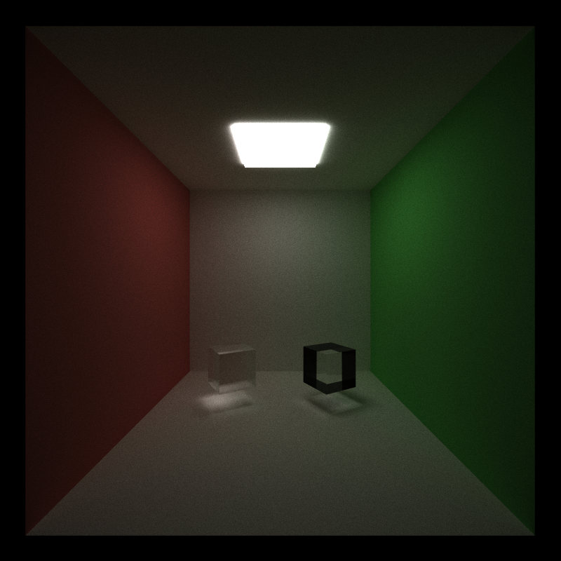

*Left: a native glass cube. Right: the same cube loaded from glTF, same material, same IOR. 5000 spp, depth 32.*

Both cubes go through the same `scatterRay`, so the difference had to be on the intersection side. Narrowing it down:
- Bounding-box culling off: frame still there
- Mesh unrotated: still there
- Fully closed box: still there, so paths were being lost, not escaping
- IOR 1.0: both cubes vanish, so entry and exit hits are found correctly
- Mirror material: both cubes identical, so single hits and normals are fine
- A debug view that colors paths by how they ended: the frame lit up as "direction is NaN"

Only paths that reflected *inside* the mesh died, and they died with a NaN direction. The source is this repo's glm 0.9.x, whose `refract` handles total internal reflection as

```cpp
return (eta * I - (eta * dotValue + sqrt(k)) * N) * static_cast<T>(k >= 0);
```

`sqrt` of a negative `k` is NaN, and NaN times zero is still NaN, so the zero vector the code was checking for never arrives.

Why nothing had triggered it before:
- Light inside a solid sphere always meets the far wall below the critical angle, so a glass sphere never hits TIR
- The native cube had a second bug hiding it: the base code's box intersection returns a normal facing the ray on inside hits, while sphere and mesh return the outward normal
- The dielectric code reads "entering or leaving" from that sign, so the native cube always thought it was entering, used the wrong index ratio on the way out and never reflected internally. It looked clean because it never took the path that crashed

Both fixes are one-liners: compute `k` in `scatterRay` and only call `refract` when it is non-negative, and negate the box normal on inside hits so all three geometry types agree.

After both fixes the two cubes agree, and the side faces mirror the red and green walls, which is total internal reflection doing what it should. That render is the image at the top of the [Refraction](#refraction) section.

### The texture that read backwards

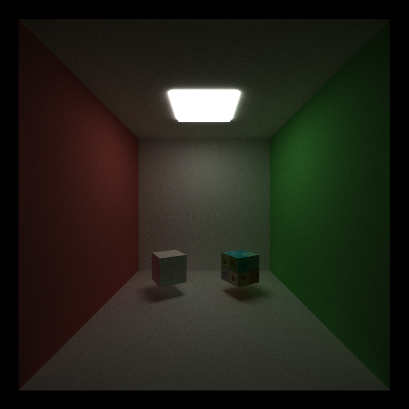

*A UV checker on the glTF cube. 5000 spp. Every digit is mirrored, and the faces show red and teal digits from the bottom half of the image where black ones from the top half belong.*

What gave it away:
- The checker's four quadrants are color coded, so each face says which part of the image it is reading
- Each face straddled the vertical divider as expected, so u was right
- Each face showed the wrong half top to bottom, so v was inverted

The sampler had `v = 1 - uv.y`, the flip that OpenGL-style code needs because its texture origin is the bottom left. glTF defines the origin at the top left, and `stb_image` returns row 0 as the top row, so the two already agree and v maps straight to the row index. Removing the flip fixed it.

Some digits still sit sideways after the fix. That is the model, not the renderer: Blender's default cube unwraps into a cross, and several faces are rotated 90 degrees in UV space. A winding check on each visible face confirms the texture is rotated but never mirrored.

### The bevel that ate light

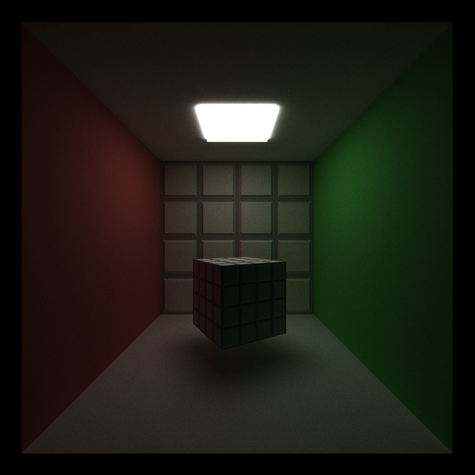

*Bump mapping before the fix. 5000 spp. It looks plausible, which is what made it easy to miss.*

The top edge of every tile faces the light and should be the brightest part of the tile. It measured 49 against 50 for the flat tile next to it.

A bumped normal tilts the whole sampling hemisphere, and part of it ends up under the wall. Rays sent that way enter the wall and come back black.

| | Bump off | Before | After |
|---|---|---|---|
| Edge facing the light | 50 | 49 | 53 |
| Edge facing away | 49 | 24 | 31 |
| Whole frame | 27.3 | 26.4 | 27.0 |

The fix mirrors any scattered direction that points under the real surface back above it. Bump mapping should only move light around, and the whole-frame average says it now nearly does.

### The sink that was a broken mirror

| Perfect mirror | Exponent 200 |
|---|---|
|  |  |

*The first render with real materials, and the same scene after the fix. The faucet looks like chrome either way. The basin on the left looks like it was dropped.*

The material was a perfect mirror, and the render is correct: each black shard is a reflection of something dark, and dragging the camera made the shards slide around, which ruled out the model. A basin is a mirror facing itself, so most of what it reflects is its own far wall reflecting the underside of the counter.

A real sink is brushed, and a brushed surface blurs its reflections. That was the push to add the Phong exponent, and with it set to 200 the basin reads as steel.

## Build notes

Built with Visual Studio 2022 and CUDA 13.3 on Windows 11, for an RTX 3090 Ti; the CUDA architecture is left at `native`, so CMake picks the GPU it finds.

`CMakeLists.txt` has one change beyond the source file list: MSVC gets `/Zc:preprocessor` for both C++ and CUDA, which enables the conforming preprocessor.

```powershell
cmake -S . -B build -G "Visual Studio 17 2022"
cmake --build build --config Release
& ".\build\bin\Release\cis565_path_tracer.exe" "scenes/core/cornell.json"
```

Every timing in this README is from a Release build. Debug and RelWithDebInfo compile the CUDA with `-G`, which turns off device optimization and makes a frame many times slower; they are for stepping through kernels, not for measuring them.

- Esc saves the image and exits
- S saves the image without exiting, and the filename is printed to the console

Every optional stage is a `#define` at the top of [`src/pathtrace.cu`](src/pathtrace.cu), so any combination can be built and measured without touching the rest of the code:
- `STREAM_COMPACTION`, `SORT_BY_MATERIAL`, `ANTIALIASING`, `MESH_AABB_CULL`, `BVH`, `DIRECT_LIGHTING`, `DEPTH_OF_FIELD`, `PERF_LOG`
- `DEBUG_NORMALS`, `DEBUG_UV`, `DEBUG_TANGENT`, `DEBUG_BUMP`: paint the first hit with its normal, UV, tangent or bumped normal
- `DEBUG_TERMINATION`: paints each path by how it ended (depth exhausted, NaN direction, NaN origin, genuine miss). This is how the glass bug in the bloopers was found

## References
- Path tracing background and the BSDF formulation follow [Physically Based Rendering, 4th edition](https://pbr-book.org/4ed/Reflection_Models/Diffuse_Reflection)
- Staged-kernel pipeline follows the CIS 5650 [path tracing primer recitation](https://docs.google.com/presentation/d/1rr6zFbpVkdMEkxBK4QLN4_tBRo168SJA_bMi2GkBB6I/edit?usp=drive_link)
- Compaction and sorting use [Thrust](https://nvidia.github.io/cccl/thrust/)
- UV checker texture from [oxpal.com](https://www.oxpal.com/uv-checker-texture.html)
- Sink and faucet: [Small Sink and Faucet](https://sketchfab.com/3d-models/92e6ad65f7c541b38b949f643d24400e) by 3DJeff, CC Attribution
- From [Poly Haven](https://polyhaven.com), CC0: [Lemon](https://polyhaven.com/a/lemon), [Wooden Cutting Board](https://polyhaven.com/a/wooden_cutting_board), [Wooden Spoon](https://polyhaven.com/a/wooden_spoon), [Potted Plant 04](https://polyhaven.com/a/potted_plant_04), and [Multi Cleaner Bottle](https://polyhaven.com/a/multi_cleaner_bottle)
- Marble texture: [Marble 012](https://ambientcg.com/view?id=Marble012) from ambientCG, CC0
